# OpenShift + CFK + Flink Local Engineering Learning Guide

> **What this document is:** a complete, hands-on engineering bootcamp for the platform implemented in this repository — Confluent Platform on Kubernetes (CFK) in KRaft mode, Kerberos-authenticated Kafka Connect against SQL Server, Apache Flink on the native Flink Kubernetes Operator, Argo CD GitOps, and a dedicated Prometheus/Grafana observability stack. Everything in this guide was checked against the actual manifests, scripts, and source code in this repository — not against what the older per-topic docs *say* the repository does. Where those two disagree, this guide says so explicitly and tells you which one to trust.
>
> **How this document was built:** every claim below was verified against `apps/`, `base/`, `overlays/`, `bootstrap/`, `scripts/`, `flink-jobs/`, and the Java source, not inferred from the older docs alone. A full credential scan was run before writing (see the Security Note in §1). Facts that could not be verified, or that the repository's own docs/manifests disagree on, are called out under **Implementation Finding**.

---

## How to use this guide

You don't have to read this linearly. Pick the path that matches you:

**Path A — New engineer, first time with this stack.** Read sequentially: Part I (architecture) → Part II (Kubernetes/GitOps concepts) → Part III (security foundation) → Part IV (Confluent Platform) → Part V (Kerberos) → Part VI (Flink) → Part VII (observability) → Part VIII (hands-on install). Do the install only after you understand what you're installing — the install steps assume the concepts from Parts I–VII.

**Path B — Experienced Kubernetes engineer, new to this stack.** Skim Part II (you know this), read Part III quickly, then focus on Part IV (CFK-specific behavior), Part V (Kerberos — this is genuinely unusual and worth full attention), Part VI (Flink control-plane distinction), and Part VII (observability). Then go straight to Part VIII.

**Path C — Senior engineer / architect, evaluating this for a client.** Read Part I for scope, then jump to Part XIII (production differences), Part XIV (architecture decisions and discovery questions), and Part X (troubleshooting trees) to understand where this design would need to change for a real deployment. Use Part V and Part VII as reference depth when the conversation gets technical.

Every part follows the same teaching pattern where it explains a platform capability: **what it is → why it's needed → where it lives in this repo → how it works → how it connects to other pieces → the security model → how to deploy/validate it → what breaks and how to tell → how production would differ.** Not every section needs every step — trivial ones are skipped rather than padded.

---

## Table of contents

- [Part I — Learning the Platform](#part-i-learning-the-platform)
  - [1. Introduction](#1-introduction)
  - [2. Architecture Before Installation](#2-architecture-before-installation)
- [Part II — Core Concepts](#part-ii-core-concepts)
  - [3. Kubernetes and OpenShift Fundamentals for This Lab](#3-kubernetes-and-openshift-fundamentals-for-this-lab)
  - [4. Operators and Reconciliation](#4-operators-and-reconciliation)
  - [5. Kustomize](#5-kustomize)
  - [6. Argo CD and GitOps](#6-argo-cd-and-gitops)
- [Part III — Security Foundation](#part-iii-security-foundation)
  - [7. TLS and cert-manager](#7-tls-and-cert-manager)
  - [8. Secrets and Sealed Secrets](#8-secrets-and-sealed-secrets)
- [Part IV — Confluent Platform](#part-iv-confluent-platform)
  - [9. CFK Architecture](#9-cfk-architecture)
  - [10. KRaft Deep Dive](#10-kraft-deep-dive)
  - [11. Kafka Broker Architecture](#11-kafka-broker-architecture)
  - [12. Schema Registry](#12-schema-registry)
  - [13. Kafka Connect](#13-kafka-connect)
  - [14. REST Proxy](#14-rest-proxy)
  - [15. Control Center](#15-control-center)
- [Part V — Kerberos and SQL Server](#part-v-kerberos-and-sql-server)
  - [16. Why Kerberos Exists Here](#16-why-kerberos-exists-here)
  - [17. Why Samba AD Instead of MIT KDC](#17-why-samba-ad-instead-of-mit-kdc)
  - [18. Why SQL Server and AD Run Outside OpenShift](#18-why-sql-server-and-ad-run-outside-openshift)
  - [19. Kerberos End-to-End Authentication](#19-kerberos-end-to-end-authentication)
  - [20. Four Kerberos Configuration Layers](#20-four-kerberos-configuration-layers)
  - [21. Multiple Connectors / Multiple SQL Servers](#21-multiple-connectors-multiple-sql-servers)
- [Part VI — Apache Flink](#part-vi-apache-flink)
  - [22. What Flink Is](#22-what-flink-is)
  - [23. Flink Deployment Architecture](#23-flink-deployment-architecture)
  - [24. Flink Job Walkthrough](#24-flink-job-walkthrough)
  - [25. Flink Failure and Recovery](#25-flink-failure-and-recovery)
- [Part VII — Observability](#part-vii-observability)
  - [26. Observability Architecture](#26-observability-architecture)
  - [27. Prometheus Operator](#27-prometheus-operator)
  - [28. Metrics Discovery](#28-metrics-discovery)
  - [29. Kafka Observability](#29-kafka-observability)
  - [30. Producer / Consumer / Consumer Group Visibility](#30-producer-consumer-consumer-group-visibility)
  - [31. Connect Observability](#31-connect-observability)
  - [32. Schema Registry / REST Proxy / Control Center Metrics](#32-schema-registry-rest-proxy-control-center-metrics)
  - [33. Flink Observability](#33-flink-observability)
  - [34. Grafana Dashboards](#34-grafana-dashboards)
  - [35. Alerting](#35-alerting)
  - [36. Prometheus Cardinality](#36-prometheus-cardinality)
- [Part VIII — Complete Hands-On Installation](#part-viii-complete-hands-on-installation)
  - [37. Mac Prerequisites](#37-mac-prerequisites)
  - [38. Start CRC](#38-start-crc)
  - [39. Bootstrap Platform Services](#39-bootstrap-platform-services)
  - [40. Deploy Argo CD](#40-deploy-argo-cd)
  - [41. Deploy cert-manager](#41-deploy-cert-manager)
  - [42. Deploy CFK](#42-deploy-cfk)
  - [43. Deploy KRaft](#43-deploy-kraft)
  - [44. Deploy Kafka](#44-deploy-kafka)
  - [45. Deploy Schema Registry](#45-deploy-schema-registry)
  - [46. Deploy Connect](#46-deploy-connect)
  - [47. Configure Kerberos](#47-configure-kerberos)
  - [48. Validate JDBC Source Data Flow](#48-validate-jdbc-source-data-flow)
  - [49. Deploy Flink](#49-deploy-flink)
  - [50. Validate End-to-End Flink Processing](#50-validate-end-to-end-flink-processing)
  - [51. Deploy Observability](#51-deploy-observability)
- [Part IX — Validation](#part-ix-validation)
  - [52. Final Platform Acceptance Checklist](#52-final-platform-acceptance-checklist)
- [Part X — Troubleshooting](#part-x-troubleshooting)
  - [53. Troubleshooting Methodology](#53-troubleshooting-methodology)
  - [54. Troubleshooting Decision Trees](#54-troubleshooting-decision-trees)
- [Part XI — Restart and Recovery](#part-xi-restart-and-recovery)
  - [55. Mac/CRC/Docker Restart Recovery](#55-maccrcdocker-restart-recovery)
- [Part XII — Day-2 Operations](#part-xii-day-2-operations)
  - [56. Common Operational Procedures](#56-common-operational-procedures)
- [Part XIII — Production Architecture](#part-xiii-production-architecture)
  - [57. Local Lab vs. Production](#57-local-lab-vs-production)
  - [58. Production HA](#58-production-ha)
  - [59. Production Security](#59-production-security)
  - [60. Production Observability](#60-production-observability)
- [Part XIV — RSA / Architect Learning](#part-xiv-rsa-architect-learning)
  - [61. Architecture Decisions](#61-architecture-decisions)
  - [62. Client Discovery Questions](#62-client-discovery-questions)
  - [63. Knowledge Check](#63-knowledge-check)
- [Putting It All Together](#putting-it-all-together)
- [Glossary](#glossary)


---

# Part I — Learning the Platform

## 1. Introduction

**Purpose of this lab.** This repository is a working, single-node reproduction of an enterprise Kafka + Flink streaming platform, built so an engineer can learn the real architecture — not a simplified stand-in for it — by installing and operating it directly. Every component here (Kerberos, TLS, GitOps reconciliation, RocksDB state, Prometheus scraping) behaves the way it would in a production cluster; only the *scale* and a handful of *local-only networking workarounds* are different, and those are called out explicitly every time they matter.

**Intended audience.** You understand Kafka at a basic/intermediate level, know Linux and Docker basics, and are comfortable with Git. You may have limited Kubernetes or OpenShift experience, little or no exposure to CFK, Argo CD, Flink, Kerberos/Active Directory, or Prometheus/Grafana. This guide explains each of those before asking you to operate them.

**Learning objectives.** By the end of this guide you should be able to:
- Explain why this platform uses KRaft instead of ZooKeeper, and what KRaft actually does.
- Explain the four-layer Kerberos model well enough to add a second SQL Server source connector yourself.
- Explain the difference between the native Flink Kubernetes Operator and CFK's own `FlinkApplication` CRD, and why this repository only uses one of them.
- Read a Grafana dashboard and know which underlying metric answers a specific operational question, and which questions this stack genuinely cannot answer.
- Diagnose a broken component by walking a fixed methodology (object → events → logs → network → auth → application → metrics) instead of guessing.
- Describe, to a client, what would have to change to run this in production — and why the local workarounds are not architectural choices.

**What will be running when complete** (verified against the live manifests, not assumed):

| Layer | Component | Where |
|---|---|---|
| Kubernetes platform | OpenShift Local (CRC), single node | your Mac |
| GitOps | Argo CD, app-of-apps pattern | `argocd` namespace |
| Kafka | 3 brokers, KRaft mode (no ZooKeeper) | `confluent` namespace |
| KRaft metadata | 1 controller (local overlay), 3 in the CR default | `confluent` namespace |
| Schema Registry, Kafka Connect, REST Proxy, Control Center | all CFK-managed | `confluent` namespace |
| Kerberos identity provider | Samba4 Active Directory DC | Docker Desktop (outside the cluster) |
| Source database | SQL Server 2022 | Docker Desktop (outside the cluster) |
| Stream processing | Apache Flink 1.19, one job, RocksDB state backend | `flink-jobs` namespace |
| Flink control plane | native Flink Kubernetes Operator | `flink-operator` namespace |
| Confluent's Flink control plane | CMF operator (installed, **not** the path actually used — see Part VI) | `cmf-operator` namespace |
| Metrics | Prometheus Operator + Prometheus + Grafana (7 dashboards) | `monitoring` namespace |

**Approximate resource requirements.** CRC needs 8 vCPU / ~24Gi RAM allocated to run everything above concurrently, and even then the node runs close to its allocatable ceiling (commonly 90%+ CPU/memory requests once every component is up — see §12 for the exact figures and how to relieve pressure). This is a genuinely tight fit, not a comfortable one; if your Mac has less, plan to run 1 Kafka broker instead of 3 (§57 covers exactly which file controls that).

**Approximate completion time.** Reading Parts I–VII carefully: 3–5 hours. The hands-on install in Part VIII, first time through, including the Kerberos setup: 2–4 hours, mostly waiting on pod startup and the first `crc start`.

**What you should understand at completion.** Not just *how* to run the install script, but *why* each of its 18 steps exists, what would break if you skipped it, and what changes in a real enterprise deployment. That distinction — operator vs. architect-level understanding — is the whole point of this guide.

> **Security Note (read this before anything else).** Before writing this guide, the repository was scanned for committed credentials. One real finding: `docs/kerberos-runbook.md` contains a live-looking Azure DevOps personal access token embedded in a `git credential-osxkeychain store` command. **That line is not reproduced anywhere in this guide, and this guide does not touch that file.** If you have write access to this repository, rotate that token now and remove the line — it is unrelated to any Kerberos concept and appears to be an accidental commit. Separately, `scripts/seal-secrets.sh` and `scripts/generate-observability-load.sh` contain plaintext passwords (`KafkaAdmin@Local2024!`, `C3Admin@Local2024!`, `GrafanaAdmin@Local2024!`, and similar) — these are **intentional, documented local-development defaults** for a disposable local cluster, not a leak, and this guide references them the same way the repository's own scripts do. Every other secret-shaped string found in the repo (`base/observability/secrets/grafana-admin-sealed.yaml`, every `*-sealed.yaml` file) is `kubeseal`-encrypted ciphertext, which is safe to commit by design and is never decryptable without the specific cluster's private key.

## 2. Architecture Before Installation

Before touching a single command, build the mental model. The platform is layered:

```text
Your Mac
  └─ Docker Desktop            (SQL Server + Samba4 AD DC — outside Kubernetes entirely)
  └─ CRC VM                    (single-node OpenShift cluster)
       └─ OpenShift
            └─ Argo CD (GitOps engine, reads this git repo)
                 └─ Operators (CFK, Flink Kubernetes Operator, CMF, Prometheus Operator)
                      └─ Confluent Platform (Kafka/KRaft/Connect/SR/RestProxy/Control Center)
                      └─ Apache Flink (JobManager/TaskManager, RocksDB state)
                      └─ Prometheus + Grafana
```

Each arrow above is a real, separate control loop: Argo CD reconciles *Kubernetes objects* (Applications, CRs, Secrets); each operator then reconciles *its own* CRs into pods/services; nothing here is a single monolithic install. That separation is exactly why troubleshooting later works layer by layer (Part X) rather than as one big guess.

### Diagram A — High-level architecture

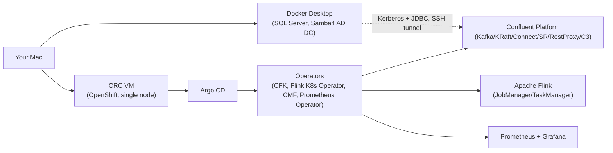

This is the map for the whole guide: Docker Desktop is a peer of the CRC VM, not a part of it — it exists only because SQL Server's container image cannot run on this Mac's CRC VM architecture (Part V, §18, explains exactly why). Everything else is genuinely inside the OpenShift cluster.

### Diagram B — Kubernetes namespace architecture

Every namespace below is real, taken from `base/namespaces/all-namespaces.yaml` and the `metadata.namespace` fields across the manifests — nothing here is invented:

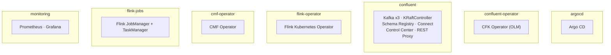

> **Architect's Note.** `cert-manager` is installed by `scripts/bootstrap.sh` via Helm into its own `cert-manager` namespace (created by the chart itself, not listed in `all-namespaces.yaml` since Argo CD doesn't own it — it's a bootstrap-phase install, see §39). Keep that distinction in mind: not everything running on this cluster is Argo-CD-managed; the bootstrap phase (§37–41) exists precisely to solve the chicken-and-egg problem of "what deploys the thing that deploys everything else."

### Diagram C — Data flow

This is the actual record path, start to finish, using the real topic names from `base/confluent-platform/sqlserver-claims-topic.yaml`, `base/confluent-platform/flink-claims-topics.yaml`, and `flink-jobs/claims-processor/src/main/java/com/statefarm/flink/ClaimsProcessorJob.java`:

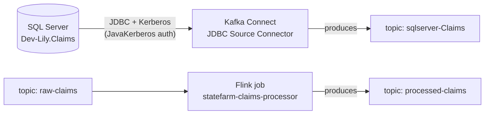

Two independent topics matter here and it's easy to conflate them: `sqlserver-Claims` is what the JDBC Source Connector actually writes (Part IV, §13); `raw-claims`/`processed-claims` is what the Flink job actually reads/writes (Part VI, §24). **Implementation Finding:** nothing in this repository currently connects the two — no connector or job bridges `sqlserver-Claims` into `raw-claims`. The Flink job's input topic is fed only by whatever a test producer writes to `raw-claims` directly; treat the Kerberos/JDBC pipeline and the Flink pipeline as two independently-provable flows (Part VIII, §48 and §50 validate them separately) rather than one continuous one, until/unless that bridge is built.

### Diagram D — GitOps flow

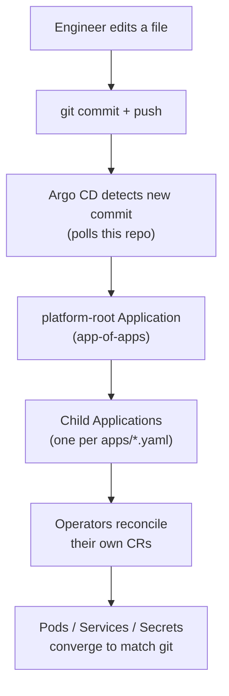

`apps/app-of-apps.yaml` is the one Application `scripts/bootstrap.sh` applies by hand; every other Application in `apps/*.yaml` is *discovered* from it because its `source.path` is `apps` — Argo CD reads that whole directory as its own desired state. This is why installation order matters (Part II, §6): a child Application can only start reconciling once the operator that understands its CRD exists, which is why `sync-wave` annotations exist at all.

---

# Part II — Core Concepts

## 3. Kubernetes and OpenShift Fundamentals for This Lab

This section explains only the primitives this repository actually uses, in the order you'll meet them.

**Cluster / node.** A cluster is the whole system; a node is one machine (physical or VM) that runs workloads. CRC gives you exactly **one node** — this is the single fact that shapes almost every "local lab limitation" called out later in this guide (§57).

**Namespace.** A logical partition of the cluster — RBAC, NetworkPolicy, and resource quotas are usually scoped to a namespace. This repo's real namespaces are the seven listed in Diagram B, plus `cert-manager` and `kube-system`/`openshift-*` system namespaces you don't manage directly.

**Pod.** The smallest deployable unit — one or more containers that share a network namespace and are always scheduled together. Every Kafka broker, every Flink TaskManager, is one pod.

**Deployment vs. StatefulSet.** A Deployment manages interchangeable pod replicas with no persistent identity (Argo CD itself, the CFK operator, Grafana). A StatefulSet gives each replica a stable name and its own PersistentVolumeClaim (`kafka-0`, `kafka-1`, `kafka-2`, `kraftcontroller-0`) — CFK creates StatefulSets under the hood for every stateful CR it manages. You will not write either of these directly in this repo; you write a CFK Custom Resource (`Kafka`, `KRaftController`, ...) and the CFK operator creates the StatefulSet for you. That indirection is the entire point of the operator pattern (§4).

**Service.** A stable network name/IP that load-balances to a set of pods matched by label selector. `kafka:9071` resolves to a Service, not to any one broker pod directly. CFK creates a headless Service (`ClusterIP: None`) for its stateful components, because each broker's own pod DNS name matters for peer discovery.

**Route.** OpenShift-specific — an HTTP(S) ingress that exposes a Service outside the cluster, terminating TLS at the edge. Every `*.apps-crc.testing` URL in this guide is a Route. (Plain Kubernetes uses `Ingress` instead; OpenShift has both, but this repo uses `Route` since CFK's `externalAccess.type: route` field expects it.)

**ConfigMap / Secret.** Non-confidential and confidential key-value data, respectively, injected into pods as env vars or mounted files. Every `krb5.conf`, every keytab, every TLS certificate in this platform arrives at its pod through one of these two objects — never baked into an image.

**PVC / StorageClass.** A PersistentVolumeClaim requests durable storage; a StorageClass tells Kubernetes *how* to provision it. This cluster's only StorageClass is `crc-csi-hostpath-provisioner` (CRC's built-in hostpath provisioner) — every Kafka broker's `data0-kafka-N` PVC, and Control Center's own data PVCs, are provisioned from it.

**ServiceAccount / RBAC.** A ServiceAccount is an identity a pod authenticates to the Kubernetes API as; RBAC (`Role`/`RoleBinding`/`ClusterRole`/`ClusterRoleBinding`) grants that identity specific verbs on specific resources. `flink-service-account` (Part VI, §23) is the concrete example you'll read in depth — including a genuinely subtle RBAC gotcha (the `deployments/finalizers` subresource) that broke Flink's own TaskManager creation until it was found.

**NetworkPolicy.** A default-deny-plus-explicit-allow firewall inside the cluster's own pod network. `bootstrap/network-policies.yaml` is entirely built this way: nothing talks to anything by default, and every real communication path (Prometheus→Kafka's metrics port, Connect→Kafka, Kafka→KRaft, and so on) gets its own explicit ingress rule. This matters directly in Part VII and Part X — "component running but unreachable" is very often a missing NetworkPolicy rule, not a broken component.

**SCC (Security Context Constraint) and `restricted-v2`.** OpenShift-specific, and one of the more consequential concepts in this whole platform. Where plain Kubernetes lets any pod request `runAsUser: 0` unless something stops it, OpenShift's default `restricted-v2` SCC assigns every pod a **randomly-allocated non-root UID from that namespace's own reserved range**, and forbids the pod from choosing its own. This repository's convention, everywhere, is to *never hardcode* `runAsUser`/`fsGroup` in a `podSecurityContext` — every place a Helm chart's own defaults hardcode a UID (the Flink Kubernetes Operator chart defaults to `runAsUser: 9999`, for one real example — see `apps/flink-kubernetes-operator-app.yaml`), this repo explicitly nulls it out so `restricted-v2` can assign one instead. Skipping this is the single most common cause of a pod refusing to schedule at all (Part X, §53's decision tree starts here).

**CRD / Custom Resource / Operator.** A CustomResourceDefinition teaches the Kubernetes API server a new object type (e.g., `Kafka`, `FlinkDeployment`); a Custom Resource is an instance of that type you create (`kind: Kafka, metadata.name: kafka`); an Operator is the controller process that watches Custom Resources and does the actual work of making the cluster match them. This is the single most important pattern in this whole repository — the next section is dedicated to it.

**Why three Kafka broker pods on one CRC node is not true high availability.** This repository does run `Kafka.spec.replicas: 3`, and you will see three independent broker pods, three independent PVCs, real partition leadership spread across them. That is genuinely useful for learning Kafka's *topology* — leader election, ISR, replication factor all behave for real. But all three pods share **one physical failure domain**: one Linux kernel, one disk subsystem, one network interface, one power supply (the CRC VM itself). If that VM goes down, all three brokers go down together, at the same instant, for the same reason. Real HA requires independent failure domains — Part XIII, §58 covers what that actually takes.

## 4. Operators and Reconciliation

An operator's whole job is a loop, forever:

```text
1. Watch: has any Kafka CR changed, or has the cluster drifted from what it says?
2. Compare: what does the CR ask for, vs. what pods/services/secrets currently exist?
3. Act: create/update/delete whatever's needed to close that gap.
4. Repeat.
```

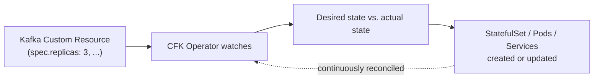

This is why `oc edit pod kafka-0` is almost always the wrong move in this environment: the operator didn't create that pod because you asked for a pod — it created it because the `Kafka` CR asked for 3 replicas, and the operator will simply undo any manual pod edit on its next reconcile pass (usually within seconds). The correct edit target is always the CR (or, in this repo's GitOps model, the *file that generates* the CR — see §6).

Compare three operating models directly, since this repo genuinely uses only the third:

| Model | How you make a change | Where drift comes from |
|---|---|---|
| Traditional installation | SSH in, edit a config file, restart a service | Nobody remembers every manual change made over time |
| Kubernetes declarative management | `oc apply -f kafka.yaml` by hand | Whoever applied last wins; git has no record of it |
| **GitOps (this repo)** | Edit the file in git, commit, push | Argo CD is the only thing allowed to apply — drift is detectable by diffing git against cluster |

## 5. Kustomize

Kustomize lets you keep one canonical set of manifests (a **base**) and layer environment-specific differences (an **overlay**) on top, without duplicating the base files. This repo's actual base/overlay split:

- **Base:** `base/confluent-platform/` — every CFK Custom Resource (`kafka.yaml`, `kraft.yaml`, `connect.yaml`, ...), environment-agnostic.
- **Overlay:** `overlays/local/` — what this guide actually deploys. Its `kustomization.yaml` lists `base/confluent-platform` as its `resources`, then layers four `patches`: `kraft-patch.yaml`, `kafka-patch.yaml`, `sr-patch.yaml`, `connect-patch.yaml`.
- **A second overlay exists but is unvalidated:** `overlays/prod/` — only one patch file (`kafka-patch.yaml`), documented as a *starting point*, never run against a real cluster. Part XIII, §57 compares it directly against `overlays/local`'s version field by field.

Run this yourself to see exactly what gets sent to the API server, with zero cluster access required:

```bash
# Render the fully-merged manifests Argo CD would apply for the local overlay
oc kustomize overlays/local
```

**Expected:** a single large YAML stream — every `Kafka`/`KRaftController`/`SchemaRegistry`/`Connect` CR from `base/confluent-platform`, each with the corresponding patch's fields merged in (strategic merge, meaning patch fields overwrite base fields with the same key; anything not mentioned in the patch is left alone). Confirm this concretely: `overlays/local/kraft-patch.yaml` sets `spec.replicas: 1`; the base `base/confluent-platform/kraft.yaml` says `spec.replicas: 3`. Grep the rendered output for `replicas` under `kind: KRaftController` and you'll see `1` — the overlay wins, as expected.

The local overlay's `kafka-patch.yaml` is a good example of an overlay changing behavior *without* changing a number: it nulls out `podTemplate.affinity` entirely (base has a soft `preferredDuringSchedulingIgnoredDuringExecution` pod anti-affinity), because on a single-node cluster there is no second node to spread across — leaving the anti-affinity in place would do nothing but add noise to `oc describe pod` output.

## 6. Argo CD and GitOps

**Desired state / reconciliation.** Git is the single source of truth for "what should exist." Argo CD's entire job is closing the gap between that and "what currently exists" — the same operator pattern from §4, but one layer up: Argo CD reconciles *Kubernetes objects themselves* (Applications, and through them, arbitrary manifests), while CFK/FKO/etc. reconcile *their own CRs* into pods.

**app-of-apps.** `apps/app-of-apps.yaml` is one Argo CD `Application` whose `source.path` is the `apps/` directory itself. Applying that one file is the only manual `oc apply` this whole repo needs (done once, by `scripts/bootstrap.sh`) — Argo CD then reads every other file under `apps/` as more Applications to manage, recursively. This is the entire "app-of-apps" pattern in one sentence: **the root Application's job is to discover the other Applications, not to deploy anything itself.**

**Sync waves.** Applications can carry an annotation, `argocd.argoproj.io/sync-wave: "N"`, and Argo CD deploys lower-numbered waves first, waiting for each wave to reach `Healthy` before starting the next. This repo's actual wave assignments (verified against every `apps/*.yaml` file):

| Wave | Application | Why it has to go first |
|---|---|---|
| 0 | `confluent-operator`, `flink-kubernetes-operator` | The CRDs (`Kafka`, `FlinkDeployment`, ...) must exist before anything can create a CR of that kind |
| 1 | `cmf-operator`, `confluent-platform` | Confluent Platform CRs need the CFK operator (wave 0) already running to reconcile them |
| 2 | `flink-jobs` | The `FlinkDeployment` CR needs the Flink Kubernetes Operator (wave 0) already running |

> **Implementation Finding.** `apps/cmf-operator-app.yaml` carries `sync-wave: "1"`, but `docs/architecture.md`'s own sync-wave table lists it at wave `"0"` and describes it as a "Flux HelmRelease" — neither matches reality. It is wave `1`, and it's an Argo CD Application using Argo's **native Helm source support** (`repoURL: https://packages.confluent.io/helm`, `chart: confluent-manager-for-apache-flink`), not Flux. `apps/cmf-operator-app.yaml`'s own header comment explains why: Flux was never installed on this cluster, so an earlier Flux-based design could never have worked. Trust this guide's table above and the file itself, not `docs/architecture.md`'s wave table, on this point.

**Automated sync, prune, selfHeal.** Every child Application in this repo sets `syncPolicy.automated: {prune: true, selfHeal: true}`. `prune` means: if a manifest is deleted from git, Argo CD deletes the corresponding object from the cluster (not just stops managing it). `selfHeal` means: if someone manually edits a live object (`oc edit`, `oc scale`), Argo CD reverts it back to match git on its next reconcile pass — usually within seconds. Together, these two flags are what make "commit to git" the *only* durable way to change this cluster; anything else is temporary by design.

**Drift, OutOfSync, and why operators can create *apparent* drift.** Argo CD computes `OutOfSync` by diffing git's manifest against the live object's full state — but every operator-managed CR gets a `.status` subtree written back by its own operator (current replica count, conditions, observed generation) that was never in git and was never meant to be. Naively, that would make every CFK-managed CR permanently `OutOfSync`. This repo's Applications each carry an explicit `ignoreDifferences` block for exactly this reason — e.g. `apps/confluent-platform-app.yaml` ignores `/status` on `Kafka`, `KRaftController`, `SchemaRegistry`, `Connect`, `ControlCenter`, and `KafkaRestProxy`; `apps/flink-jobs-app.yaml` does the same for the (unused) `FlinkApplication`/`FlinkEnvironment` kinds. Without this, you'd see permanent, meaningless `OutOfSync` status that has nothing to do with real drift — and you'd stop trusting the signal exactly when you need it most (Part X's troubleshooting methodology depends on `OutOfSync` meaning something).

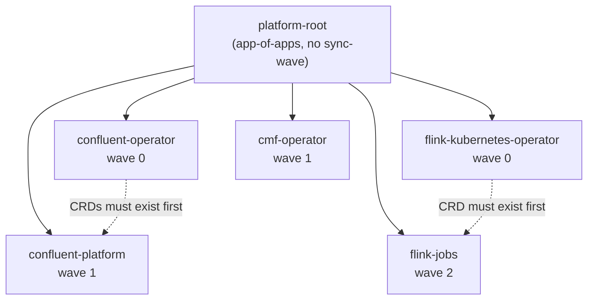

---

# Part III — Security Foundation

## 7. TLS and cert-manager

Every TLS certificate on this platform traces back to one chain, built by `bootstrap/cert-manager-issuers.yaml`:

```text
ClusterIssuer "selfsigned-bootstrap"   (a bare self-signed issuer, exists only to bootstrap the next step)
 ↓ issues
Certificate "platform-root-ca"          (isCA: true, RSA 4096, 10-year duration, CN "platform-root-ca")
 ↓ produces
Secret "platform-root-ca-secret"        (namespace cert-manager — the actual root CA key pair)
 ↓ backs
ClusterIssuer "platform-ca-issuer"      (spec.ca.secretName: platform-root-ca-secret)
 ↓ issues every leaf certificate below
Certificate → Secret, one pair per component
```

The five leaf certificates are declared in `bootstrap/platform-certificates.yaml`, all through `platform-ca-issuer`, all RSA 2048/PKCS8, 1-year duration, 30-day (`720h`) renewal window:

| Certificate | Secret | DNS names (exact, from the manifest) |
|---|---|---|
| `kafka-tls` | `kafka-tls-secret` | `kafka`, `kafka.confluent.svc.cluster.local`, `*.kafka.confluent.svc.cluster.local`, `kafka-bootstrap.apps-crc.testing`, `*.apps-crc.testing` |
| `schemaregistry-tls` | `schemaregistry-tls-secret` | `schemaregistry.confluent.svc.cluster.local`, `schemaregistry.apps-crc.testing` |
| `connect-tls` | `connect-tls-secret` | `connect.confluent.svc.cluster.local`, `connect.apps-crc.testing` |
| `controlcenter-tls` | `controlcenter-tls-secret` | `controlcenter.confluent.svc.cluster.local`, `controlcenter.apps-crc.testing` |
| `restproxy-tls` | `restproxy-tls-secret` | `kafkarestproxy.confluent.svc.cluster.local`, `kafkarestproxy.apps-crc.testing` |

Kafka's certificate is the only one with a wildcard SAN (`*.apps-crc.testing`) and a per-pod wildcard (`*.kafka.confluent.svc.cluster.local`) — it has to cover both the headless per-broker Service names (`kafka-0.kafka.confluent.svc.cluster.local`, etc.) and the external Route, where the other four components only ever need one internal + one external name each.

**Concepts, defined once here since every component below reuses them:**
- **CA (Certificate Authority):** the entity whose signature makes a certificate trustworthy. Here, `platform-root-ca` — entirely self-signed, entirely local to this cluster. No public CA is involved anywhere in this platform.
- **Server certificate:** what a listening service presents to prove its own identity (every `*-tls-secret` above).
- **Client certificate / mTLS:** the *reverse* — a client also proving its identity via a certificate. **This platform does not use mTLS anywhere** — every TLS connection here is one-way (the server proves who it is; the client instead proves who it is via SASL/PLAIN credentials or, for the JDBC connector, Kerberos). Confirm this yourself: `kafka.yaml`'s listeners each set `authentication.type: plain`, not a client-cert type.
- **SAN (Subject Alternative Name):** the DNS names field above — TLS clients validate the *hostname they connected to* against this list, not the certificate's `commonName`. This is why every certificate needs both its internal Service DNS name and, where applicable, its external Route hostname.
- **Truststore vs. keystore:** a keystore holds *your own* private key + certificate (what a server presents); a truststore holds *other parties'* CA certificates (what you use to decide whether to trust someone else's certificate). Every CFK component gets its keystore straight from its `*-tls-secret` (PEM, CFK converts internally); Connect additionally needs an explicit **truststore** to trust Schema Registry's certificate from the JVM's own TLS stack — that's exactly what `connect-truststore-configmap.yaml` is, rebuilt fresh by `scripts/kerberos/setup-kerberos.sh` every run (Part V, §20 covers why).
- **Why Kafka *clients* need trust at all, even with SASL auth:** SASL/PLAIN over `SASL_SSL` still runs inside a TLS tunnel — the credential exchange itself is protected by TLS, so every client (Connect, Schema Registry, REST Proxy, Control Center, the Flink job) still needs to trust `platform-root-ca` before it will even attempt the SASL handshake. `ClaimsProcessorJob.java`'s `ssl.truststore.location=/mnt/kafka-ca/ca.crt` (a PEM-format truststore, not JKS) is this exact requirement, satisfied the lightweight way for a plain Java client instead of via a full JKS truststore.

**Validation commands:**

```bash
# Confirm the root CA and every leaf certificate are Ready
oc get certificate -A
oc describe certificate kafka-tls -n confluent | grep -A3 Conditions

# Inspect the actual cert Kafka is serving, from outside kubectl entirely
openssl s_client -connect kafka.apps-crc.testing:443 -servername kafka.apps-crc.testing </dev/null 2>/dev/null | openssl x509 -noout -subject -issuer -dates
```

**Expected:** every `Certificate` object reports `READY=True`; the `openssl` output shows `issuer= O=statefarm-local, CN=platform-root-ca` and a `notAfter` roughly one year out. If a certificate sits `False`, see Part X's decision tree for `Certificate` failures — it almost always traces back to `platform-root-ca-secret` missing or the issuer chain being broken, not the leaf certificate's own spec.

## 8. Secrets and Sealed Secrets

Kubernetes `Secret` objects are only base64-encoded, not encrypted — anyone with read access to the cluster's etcd (or, more relevantly here, anyone who can read a Secret manifest committed to git) can read them in plaintext. **This repository never commits a plain `Secret` manifest.** Every credential goes through this pipeline instead:

```text
Real credential (only ever typed into scripts/seal-secrets.sh, never written to disk unencrypted)
 ↓ piped into `kubeseal --cert <public-cert> --format yaml`
SealedSecret manifest                    (asymmetrically encrypted — safe to commit)
 ↓ git commit + push
Argo CD applies the SealedSecret to the cluster
 ↓
Sealed Secrets controller (namespace kube-system) decrypts it with its own private key
 ↓
A real Kubernetes Secret object appears, only inside the cluster, never in git
```

`kubeseal` uses **asymmetric encryption**: it needs only the sealed-secrets controller's *public* certificate to encrypt (fetched once by `scripts/bootstrap.sh` into `/tmp/sealed-secrets-public-cert.pem`), and only the controller's *private* key — which never leaves the cluster, isn't in git, and isn't visible to `kubeseal` itself — can decrypt it back into a real Secret. This is exactly why a `SealedSecret` is safe to put in a public or semi-public git repository: possessing the encrypted manifest gives you nothing without that specific cluster's private key.

**Why a SealedSecret is bound to one cluster's key, and what happens after CRC recreation.** The encryption above is tied to the specific keypair the sealed-secrets controller generated (or was given) on *that* installation. If CRC is deleted and recreated (`crc delete && crc start`, not just `crc stop`/`crc start`), a brand-new sealed-secrets controller comes up with a brand-new keypair — every previously-sealed manifest in git becomes permanently undecryptable (`no key could decrypt secret` in the controller's logs). The fix is not to restore anything; it's to re-run `scripts/seal-secrets.sh` against the *new* controller's public cert and commit the newly-sealed output (§6/§39 in Part VIII walk through exactly when this happens). A production deployment would instead back up the controller's own signing key so cluster recreation doesn't invalidate every secret in git — this repo deliberately does not do that, since a disposable local cluster has no need for it (Part XIII, §59).

**The one secret this pipeline does not produce:** `connect-keytab` is a *binary Kerberos keytab*, not a password — it's still sealed the same way (base64 → `kubeseal`), but it's generated by `scripts/kerberos/setup-kerberos.sh`, not `scripts/seal-secrets.sh`, because it doesn't come from a value a human chooses; it's exported live from the Samba4 AD domain controller. Part V covers this file's entire lifecycle.

---

# Part IV — Confluent Platform

## 9. CFK Architecture

**What CFK is.** Confluent for Kubernetes is Confluent's own operator (§4's pattern, applied to every Confluent component). It teaches the Kubernetes API server seven new CRDs — `Kafka`, `KRaftController`, `SchemaRegistry`, `Connect`, `KafkaRestProxy`, `ControlCenter`, and (unused in this repo — Part VI explains why) `FlinkApplication`/`FlinkEnvironment` — and runs one controller process that reconciles all of them.

**Install mechanism (OLM, not Helm).** Unlike the Flink Kubernetes Operator or CMF (both installed via Argo CD's native Helm support), CFK is installed through OpenShift's **Operator Lifecycle Manager**, via `base/confluent-operator/subscription.yaml`:

```yaml
apiVersion: operators.coreos.com/v1alpha1
kind: Subscription
spec:
  channel: "3.3"
  name: confluent-for-kubernetes
  source: certified-operators
  sourceNamespace: openshift-marketplace
  installPlanApproval: Manual
  config:
    env:
      - name: ENABLE_CMF_DAY2_OPS
        value: "true"
      - name: DEFAULT_DAY2_WORKER
        value: "3"
```

`installPlanApproval: Manual` is deliberate: OLM will *notice* a new version is available in the `3.3` channel, but will not install it until a human approves the `InstallPlan` (§56 walks through the approval command) — this is the gate that keeps an operator upgrade from happening silently. `spec.config.env`'s two variables are not defaults — `ENABLE_CMF_DAY2_OPS` in particular is compiled to `false` unless explicitly set, and is required for CFK to register its Flink-related controllers at all (Part VI, §23 covers exactly what that gets you and what it still doesn't). The paired `base/confluent-operator/operatorgroup.yaml` scopes the operator's watch to `targetNamespaces: [confluent, confluent-operator]` — it will not reconcile CRs created in any other namespace.

**Component lifecycle.** Every CFK-managed CR follows the same shape: `spec.image.{application,init}` (two images — the real component and CFK's own init container that renders config from the CR before the main container starts), `spec.tls.secretRef` (§7), `spec.dependencies.*` (how this component reaches Kafka/Schema Registry/Connect, each with its own `authentication`/`tls` block), and `spec.podTemplate` (resources, security context, service account). Once applied, CFK's operator creates a StatefulSet (for Kafka/KRaftController/ControlCenter, which hold data) or Deployment (for the stateless-ish SchemaRegistry/Connect/KafkaRestProxy, though even these get PVC-free StatefulSets in practice for stable network identity) plus a headless Service, and continuously reconciles both against the CR (§4).

**Deployment order in this repo** (sync-wave, from every CR's own `argocd.argoproj.io/sync-wave` annotation, cross-checked against the manifests):

| Wave | Component |
|---|---|
| 1 | `KRaftController` |
| 2 | `Kafka` |
| 3 | `SchemaRegistry` |
| 4 | `Connect`, `KafkaRestProxy` |
| 5 | `ControlCenter` |

This is *within* the `confluent-platform` Argo Application (itself wave 1 at the app-of-apps level, §6) — Argo CD applies these waves in order because each later component's `dependencies.kafka.bootstrapEndpoint`/`dependencies.schemaRegistry.url` genuinely cannot resolve to anything healthy until the earlier wave is up.

## 10. KRaft Deep Dive

**Why ZooKeeper is gone.** Kafka historically used ZooKeeper as an *external* metadata store — cluster membership, topic configuration, ACLs, controller election all lived in ZooKeeper, not in Kafka itself. KRaft (Kafka Raft) moves that metadata into Kafka's own **Raft-based consensus log**, run by a small set of dedicated controller nodes. This repository runs Kafka in **KRaft-only mode** — there is no ZooKeeper anywhere in this platform; confirm it yourself with `oc get pods -n confluent | grep -i zookeeper` (nothing returns).

**What the controller quorum actually does.** The `KRaftController` CR (`base/confluent-platform/kraft.yaml`) declares `spec.replicas: 3` in the base — this repo's local overlay patches it down to `1` (§57 covers exactly why, and what you give up by doing so). The controllers:
- Maintain the **metadata log** — every topic creation, partition reassignment, ACL change, and broker registration is an append to this Raft-replicated log, not a ZooKeeper write.
- Elect an **active controller** — exactly one controller node is the leader of the metadata Raft group at any time (`ActiveControllerCount` should always sum to exactly `1` across the whole cluster — the `KafkaNoActiveController` alert in Part VII fires precisely when it doesn't).
- Accept **broker registration** — every Kafka broker on startup registers itself with the active controller over the controller listener, rather than registering an ephemeral znode in ZooKeeper.

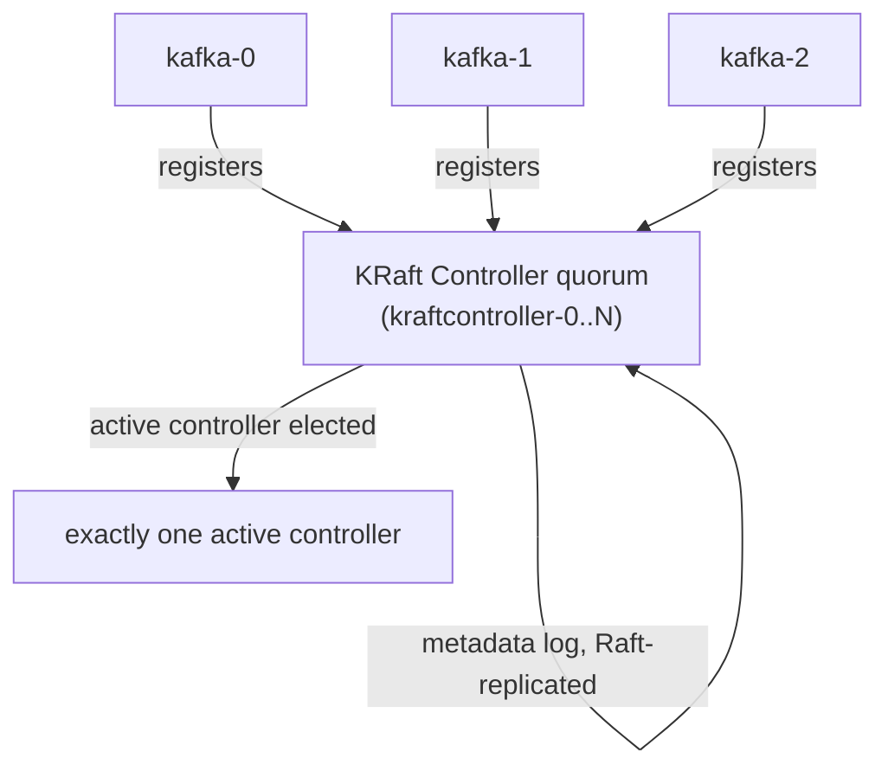

**How to validate KRaft health**, using real metric names confirmed against this cluster (Part VII, §28 explains the naming pattern these belong to):

```bash
oc get kraftcontroller kraftcontroller -n confluent -o wide
oc get pods -n confluent -l app=kraftcontroller
oc logs kraftcontroller-0 -n confluent | grep -i quorum
```

```promql
# Exactly one controller should report active=1 cluster-wide
sum(kafka_controller_kafkacontroller_value{name="ActiveControllerCount"})
# Should always be 0 for a healthy cluster
kafka_controller_kafkacontroller_value{name="OfflinePartitionsCount"}
```

> **Local Lab Limitation.** With the local overlay's `replicas: 1`, there is no quorum to lose — a controller failure here is a full metadata-plane outage, not a graceful failover. The base CR's `replicas: 3` (tolerating one controller failure) is the real, production-shaped value; §57 covers the exact resource cost of restoring it.

## 11. Kafka Broker Architecture

The `Kafka` CR (`base/confluent-platform/kafka.yaml`) declares `spec.replicas: 3`, image `confluentinc/cp-server:8.2.2`, two listeners (`internal` and `external`, both `tls.enabled: true`, both `authentication.type: plain`), and `dataVolumeCapacity: 10Gi` per broker against `crc-csi-hostpath-provisioner`.

**Listeners, TLS, SASL.** Both listeners are backed by `kafka-tls-secret` (§7); the internal listener authenticates against `kafka-internal-sasl`, the external (Route-exposed) listener against a separate `kafka-external-sasl` — two different SASL/PLAIN credential sets for two different trust boundaries, even though both terminate at the same broker process. **Every in-cluster client in this repo uses the internal listener at `kafka:9071`** — Connect, Schema Registry, REST Proxy, Control Center, and the Flink job's `BOOTSTRAP_SERVERS` constant all agree on this exact endpoint. (`docs/architecture.md` claims port `9092` for this — that is stale; §6 already flagged the wave-table error in that same file, and this port number is the more consequential one, since it appears in that doc's example troubleshooting command too. Trust `9071`, confirmed identically across `kafka.yaml`, `connect.yaml`, `schemaregistry.yaml`, `restproxy.yaml`, `controlcenter.yaml`, and the Flink job's own source.)

**Replication, ISR, min ISR — and what they mean at replication factor 1.** `kafka.yaml`'s `configOverrides.server` sets `default.replication.factor=1` and `min.insync.replicas=1` (also applied to the offsets and transaction-state internal topics). This means, honestly: **no topic in this local cluster is actually replicated**, regardless of there being 3 broker pods. Each partition has exactly one replica, which is trivially always "in sync" with itself. The three brokers give you real *leadership distribution* and real *topology* (a `describe` on any topic shows a real assigned broker), but zero redundancy — losing the one broker holding a partition's only replica loses that partition's data. Part XIII, §58 covers the production values (`replication.factor=3`, `min.insync.replicas=2`) and exactly what `overlays/prod/kafka-patch.yaml` already sets for them.

**Storage.** Each broker gets its own PVC (`data0-kafka-0`, `data0-kafka-1`, `data0-kafka-2`), `10Gi` each, from the cluster's only StorageClass. There is no tiered storage, no external log directory — everything lives on that one PVC per broker, backed by CRC's hostpath provisioner (i.e., a directory on the CRC VM's own disk).

**Validation commands**, using the real internal port:

```bash
# All three brokers Running, 1/1
oc get pods -n confluent -l app=kafka

# List topics against the internal SASL_SSL listener (adjust for your own client config)
oc exec -n confluent kafka-0 -c kafka -- kafka-topics \
  --bootstrap-server kafka:9071 \
  --command-config /mnt/sasl/client.properties \
  --list

# Confirm partition leadership is actually spread across brokers, not stuck on one
oc exec -n confluent kafka-0 -c kafka -- kafka-topics \
  --bootstrap-server kafka:9071 --command-config /mnt/sasl/client.properties \
  --describe --topic sqlserver-Claims
```

## 12. Schema Registry

**Why schemas exist.** Kafka itself has no concept of a record's structure — it stores bytes. Schema Registry gives producers and consumers a shared, versioned contract (Avro/JSON Schema/Protobuf) for what those bytes mean, and enforces **compatibility rules** (e.g., you can't remove a required field from a schema version a consumer already depends on) so producers can't silently break consumers.

**This repo's configuration** (`base/confluent-platform/schemaregistry.yaml`): one replica, image `confluentinc/cp-schema-registry:8.2.2`, its own `schemaregistry-tls-secret`, reaching Kafka at the same internal `kafka:9071` endpoint with the same `kafka-internal-sasl` credentials every other component uses, exposed externally via Route at `schemaregistry.apps-crc.testing`.

**How the JDBC Source Connector and the Flink job actually relate to it — precisely, not by assumption.** The JDBC Source Connector's `value.converter` is `io.confluent.connect.avro.AvroConverter` pointed at `https://schemaregistry.confluent.svc.cluster.local:8081` (Part V, §20's Layer-2 detail) — it genuinely registers and uses an Avro schema for `sqlserver-Claims`. The Flink job does **not** — `ClaimsProcessorJob.java` uses `SimpleStringSchema` on both source and sink, meaning it exchanges plain UTF-8 strings on `raw-claims`/`processed-claims`, with no Schema Registry interaction at all. **Implementation Finding:** don't assume every Kafka producer/consumer in this platform uses Schema Registry just because it's running — only the Connect pipeline does today.

**Security.** TLS via `schemaregistry-tls-secret`; no separate authentication scheme of its own for its REST API in this local build (Control Center authenticates to it via `c3-credentials` basic auth per `controlcenter.yaml`'s `dependencies.schemaRegistry.authentication.type: basic`, but that's C3's own credential, not something Schema Registry enforces universally on every caller).

**Validation:**

```bash
curl -sk https://schemaregistry.apps-crc.testing/subjects
# Expect: a JSON array, e.g. ["sqlserver-Claims-value"] once the connector has produced at least once
```

## 13. Kafka Connect

**Core concepts, defined before use.** A Connect **worker** is the JVM process (`connect-0`) that runs one or more **connectors**. A **connector** is a logical data-movement job (source: reads from an external system into Kafka; sink: the reverse — this repo runs source connectors only). A connector splits its work into one or more **tasks** — this repo's JDBC Source Connector runs with `tasks.max=1`, i.e. exactly one task. Connect tracks its own operational state (connector configs, consumer offsets for source connectors, task status) in three **internal Kafka topics**, whose replication factor this repo explicitly overrides down to `1` (`connect.yaml`'s `configOverrides.server`: `config.storage.replication.factor=1`, `offset.storage.replication.factor=1`, `status.storage.replication.factor=1` — matching the cluster-wide RF=1 posture from §11). A **plugin** is the JAR(s) implementing a specific connector class; this repo installs its plugin via CFK's `spec.build.onDemand.plugins.confluentHub` mechanism (a live download from Confluent Hub at pod-init time — Part V's `connect-kerberos-patch.yaml` breakdown covers this exactly), not a baked-in image.

**This repo's Connect CR** (`base/confluent-platform/connect.yaml`): one replica, image `confluentinc/cp-server-connect:8.2.2`, `connect-tls-secret`, reaching Kafka at `kafka:9071` and Schema Registry at `https://schemaregistry.confluent.svc.cluster.local:8081` — the base CR alone; Kerberos-specific fields (keytab mount, `krb5.conf`/`jaas.conf` volumes, the JDBC plugin install) live in a separate strategic-merge patch, `connect-kerberos-patch.yaml`, covered in full in Part V rather than here, deliberately — Kerberos deserves its own extended treatment, not a rushed mention mid-Connect-overview.

**The connector lifecycle, concretely, for the one connector this repo runs:** `sqlserver-claims-source` is registered via a REST `PUT` to `/connectors/sqlserver-claims-source/config` (not a CR — Connect's connectors are configured entirely through its own REST API, never through a CFK CRD field); its lifecycle states are `RUNNING`, `PAUSED`, `FAILED`, or `UNASSIGNED`, visible at `/connectors/sqlserver-claims-source/status`. Part V, §20 shows the connector's exact registered config and every field's purpose; Part VIII, §48 proves data actually flows end-to-end rather than stopping at "status says RUNNING."

## 14. REST Proxy

**Purpose.** `KafkaRestProxy` (`base/confluent-platform/restproxy.yaml`) exposes a plain HTTPS REST API in front of Kafka's native binary protocol — producing/consuming records, listing topics, and managing consumer groups over HTTP instead of a Kafka client library. Useful for clients that can't or don't want to speak the native Kafka wire protocol.

**Traffic flow / security.** REST Proxy is itself a Kafka client — it authenticates to `kafka:9071` with `kafka-internal-sasl`, and to Schema Registry with `schemaregistry-tls-secret`, exactly like Connect and Schema Registry do. Its own inbound side is TLS-terminated via `restproxy-tls-secret`, exposed externally via Route at `kafkarestproxy.apps-crc.testing`. **Implementation Finding:** nothing in this repository's own scripts or the Flink/Connect pipelines actually calls REST Proxy — it's deployed and healthy, but currently has no active consumer in this environment. Validate it exists and is reachable, not that it's "in use":

```bash
curl -sk https://kafkarestproxy.apps-crc.testing/topics
```

## 15. Control Center

**What C3 provides, and what it does not replace.** Control Center is Confluent's own operational UI — cluster/broker health, topic browsing, connector status, and (with the telemetry pipeline below wired up) broker-level metrics visualization, all through one web console with basic-auth login. It is **not** a general-purpose metrics/alerting platform, and it is not this repository's Prometheus/Grafana stack (Part VII) under a different name — the two are deliberately separate systems reading different data by different mechanisms:

| | Control Center | Prometheus + Grafana (this repo's `monitoring` namespace) |
|---|---|---|
| Mechanism | Kafka/KRaft **push** OTLP metrics to C3's own embedded Prometheus | Prometheus **pulls** (scrapes) JMX-exporter port 7778 from every component, plus Flink's 9249 |
| Scope | Broker/cluster health inside C3's own UI, plus connector/SR/Connect status pages | Everything scraped: brokers, KRaft, Connect, Schema Registry, REST Proxy, Control Center's *own* JVM, Flink JobManager/TaskManager/RocksDB |
| Alerting | C3's own embedded Alertmanager sidecar (`controlcenter-alertmanager`, port 9093) | This repo's own `PrometheusRule` objects (Part VII, §35) |
| Dashboards | Fixed, built into the C3 UI | 7 custom Grafana dashboards, fully under this repo's control |

**The actual telemetry path C3 uses**, confirmed against `kafka.yaml`, `kraft.yaml`, and `controlcenter.yaml` directly — three independent pieces, easy to conflate:

1. `Kafka`/`KRaftController`'s `spec.dependencies.metricsClient.url: http://controlcenter-prometheus.confluent.svc.cluster.local:9090` — tells each broker and the controller where to **push** OTLP metrics.
2. `ControlCenter`'s own `spec.services.prometheus`/`spec.services.alertmanager` blocks declare the actual embedded Prometheus/Alertmanager sidecar containers (images `cp-enterprise-prometheus:2.5.0`/`cp-enterprise-alertmanager:2.5.0`) that run *inside the `controlcenter-0` pod itself*, each with their own PVC.
3. Two plain `Service` objects, `controlcenter-prometheus`/`controlcenter-alertmanager`, hand-declared in the same file (not CFK-generated) — their own header comment explains why: *"CFK's generated controlcenter.properties hardcodes the prometheus/alertmanager URLs to `<name>-prometheus`/`<name>-alertmanager` regardless of the `prometheusClient`/`alertManagerClient.url` values above — these aliases give those hostnames somewhere real to resolve to."* Without these two Services, the URL in step 1 would have nothing to resolve to.

This is also why, historically, Control Center showed **"Please set up Telemetry Reporter to view broker metrics"** even after `metricsClient` was configured correctly — the underlying cause was a `NetworkPolicy` silently timing out the broker's push to port 9090 (fixed by `bootstrap/network-policies.yaml`'s `controlcenter-self` policy explicitly allowing `app: kafka`/`app: kraftcontroller` ingress on 9090). Part X's decision trees include this exact failure.

**Client (producer/consumer) monitoring.** `kafka.yaml`'s `configOverrides.server` also enables `confluent.telemetry.external.client.metrics.push.enabled=true` and a matching `confluent.telemetry.exporter._c3.metrics.include` override — this is what lets Control Center's "Setup clients" feature show per-client producer/consumer telemetry, gated on the client library meeting a documented floor (`kafka-clients 3.7.2+`/`librdkafka 2.6+`). **Implementation Finding:** the Flink job's own Kafka client (`flink-connector-kafka 3.2.0-1.19`, bundling `kafka-clients 3.4.0`) sits below that floor — the config on the broker side is correct and complete, but the Flink job's own client metrics may not appear in C3's client view regardless, purely because of the bundled client library version. This is a client-side library-version gap, not a configuration mistake in this repo.

---

# Part V — Kerberos and SQL Server

This is the single most unusual part of this platform, and deserves to be understood from zero rather than operated by rote. If you have never touched Kerberos or Active Directory before, read this part in order — every later subsection assumes the previous one.

## 16. Why Kerberos Exists Here

**Authentication vs. authorization.** Authentication answers "who are you, provably?" Authorization answers "given who you are, what are you allowed to do?" Kerberos is purely an authentication protocol — it proves identity cryptographically; SQL Server's own login/permission system is what authorizes a proven identity to actually read the `Claims` table.

**The vocabulary, defined once, in the order you'll use it:**

| Term | Meaning |
|---|---|
| **Active Directory (AD)** | A directory service (accounts, computers, groups) that also happens to run a Kerberos KDC and DNS server as part of the same product — "AD" and "a Kerberos realm" are almost synonymous in this platform |
| **Realm** | Kerberos's namespace for principals — this platform's realm is `PSYNCOPATE.COM` |
| **Domain** | AD's namespace concept, `PSYNCOPATE` (NetBIOS) / `psyncopate.com` (DNS) — maps 1:1 to the Kerberos realm here |
| **Principal** | An identity Kerberos can authenticate — either a user (`connect-svc@PSYNCOPATE.COM`) or a service |
| **SPN (Service Principal Name)** | A principal that names a *service instance*, not a person — e.g. `MSSQLSvc/192.168.126.11:14330`. A client derives the SPN it needs from what it's connecting to (host:port), not from configuration |
| **KDC (Key Distribution Center)** | The server that issues tickets — in this platform, the Samba4 AD DC itself, listening on port 88 |
| **AS (Authentication Server)** | The part of the KDC that issues the very first ticket (the TGT) in exchange for proof you hold a principal's key |
| **TGT (Ticket-Granting Ticket)** | Proof, valid for a limited time, that you successfully authenticated once — used to request further tickets without re-proving your password/key each time |
| **TGS (Ticket-Granting Service)** | The part of the KDC that exchanges a valid TGT for a **service ticket** to a specific SPN |
| **Service ticket** | A ticket, encrypted with the *target service's* key, that only that service can decrypt — this is what actually gets presented to SQL Server |
| **Keytab** | A file holding a principal's long-term key(s) — lets a service authenticate without a human typing a password (Connect and SQL Server both hold one) |
| **JAAS** | Java's pluggable authentication framework — `jaas.conf` tells the JVM's Kerberos client which principal/keytab to use |
| **`krb5.conf`** | The MIT-Kerberos-style config file naming the realm and its KDC — every Kerberos-speaking process on this platform has its own copy |
| **SPNEGO** | The negotiation wrapper that carries a Kerberos ticket inside another protocol's handshake (here: inside SQL Server's TDS login packet) |
| **GSSAPI** | The generic security API Kerberos implements — Java's `Krb5LoginModule` and SQL Server's Integrated Authentication both sit on top of GSSAPI |
| **SSSD** | *System Security Services Daemon* — the Linux service that resolves and caches identity/trust information from a directory (here: AD) for the local OS; this is what lets SQL Server's Linux container ask "is this a real, trusted domain account?" separately from just decrypting a ticket |

## 17. Why Samba AD Instead of MIT KDC

The very first working version of this platform used a plain **LDAP-backed MIT Kerberos** setup (`kdb5_ldap_util`/`kldap`) — "the standard non-Active-Directory way to run LDAP-backed Kerberos." It got far enough to prove the ticket exchange itself worked correctly: Connect obtained a TGT, obtained a service ticket for SQL Server's SPN, and SQL Server decrypted it successfully. And SQL Server still rejected the login, every time, with:

```text
Login failed. The login is from an untrusted domain and cannot be used with Integrated authentication.
```

The reason is the crux of this entire Part: **a cryptographically valid Kerberos ticket only proves the ticket wasn't forged — it says nothing about whether the identity inside it belongs to a domain SQL Server actually trusts.** SQL Server's Integrated Authentication path, on Linux, delegates that trust check to `sssd`'s `ad` **provider** specifically — and that provider only knows how to talk to a real AD-schema directory (computer objects, `sAMAccountName`, AD's LDAP schema, AD's DNS SPN conventions). A generic LDAP directory plus a separate MIT KDC, however correctly configured, is not that — there was no AD for `sssd` to trust, so the check failed even though the cryptography was flawless. Samba's AD DC mode implements the real thing (LDAP + Kerberos KDC + DNS + SMB/RPC together, all AD-schema-compatible), which is what makes `sssd`'s trust check pass. The old plain-LDAP/MIT-KDC manifests (`base/ldap/`, `base/kerberos/`) were removed from this repository once this was confirmed — nothing of that earlier approach remains to compare against directly, only this lesson.

## 18. Why SQL Server and AD Run Outside OpenShift

Two entirely separate constraints, each forcing a different piece outside the cluster.

**SQL Server: a CPU architecture mismatch, not a Kubernetes problem.** `mcr.microsoft.com/mssql/server` — every edition, including Express — is published **amd64-only**. This Mac's CRC VM is native **arm64** (Apple Silicon; CRC does not emulate an x86 VM on Apple Silicon). Confirm both facts yourself:

```bash
docker inspect mcr.microsoft.com/mssql/server:2022-latest --format '{{.Architecture}}'   # amd64
oc get nodes -o jsonpath='{.items[0].status.nodeInfo.architecture}'                       # arm64
```

Running the amd64 image on this arm64 node forces a real emulation chain: `vfkit`'s hardware-virtualized arm64 guest → CRC's Linux VM (no Rosetta wired up) → `binfmt_misc` → `qemu-x86_64` (software TCG emulation) → `sqlservr` (x86_64 ELF) → **SIGSEGV, immediately, every time**. This was root-caused thoroughly, not assumed: reproduced the identical segfault via `podman run` directly on the node (ruling out Kubernetes/SCC entirely); confirmed plain-amd64 images emulate fine under the same QEMU path (ruling out "emulation is broken in general"); tried SQL Server 2017/2019/2022 (all three crash identically, 2017/2019 even earlier); confirmed Rosetta (which *would* fix this) isn't wired into CRC's VM (an open, unmerged upstream feature request); and ruled out Azure SQL Edge as an arm64-native substitute (EOL, no ARM64 support, no AD/Kerberos integration at all). Docker Desktop's own VM *does* use Rosetta — which is exactly why SQL Server runs there instead.

**The AD DC: a UDP-over-SSH-tunnel problem, a different constraint entirely.** Standing up the AD DC in-cluster (reached the same way SQL Server would be, via an SSH tunnel into the CRC VM) was tried and failed for an unrelated reason: domain-join and `sssd`'s own AD discovery depend on a **CLDAP "netlogon ping" over UDP**, and plain `ssh -L`/`-R` port forwarding can only carry **TCP** — a hard protocol limitation of SSH itself, not a configuration mistake. A UDP-over-TCP relay pair was considered and rejected as more moving parts than simply relocating the DC. The fix: colocate the AD DC with SQL Server on Docker Desktop's own network, where CLDAP, DNS SRV lookups, LDAP, and SMB all happen over Docker's real bridge network with full native UDP support — no tunnel involved for any of that traffic. The **only** traffic that still crosses into the cluster is Connect's own AS-REQ/TGS-REQ exchange, which is TCP-only and tunnels fine — reusing the exact same reverse-SSH-tunnel mechanism already proven for SQL Server's TDS traffic, just forwarding port 88 instead of 1433.

> **Local Lab Limitation, stated as plainly as the repository's own docs state it:** none of the SSH reverse tunnels, the `iptables -j DROP` UDP rule (§20 explains exactly why that rule needs to exist), or the AD/SQL colocation on one Docker network are Kerberos concepts. They exist purely because this Mac's Docker Desktop VM and its OpenShift/CRC VM cannot natively reach each other over UDP. **In a production deployment, none of this exists** — pods reach a real, routable AD DC and a real, routable SQL Server over ordinary network paths, no tunnel, no colocation requirement, no DROP rule. §21 below spells out the production architecture explicitly.

## 19. Kerberos End-to-End Authentication

Two separate authentication events happen for every JDBC connection: Connect obtaining a service ticket (steps 1–8), and SQL Server independently verifying the identity inside that ticket is a real, trusted domain account (steps 9–12) — the second event is the one §17 showed cannot be skipped.

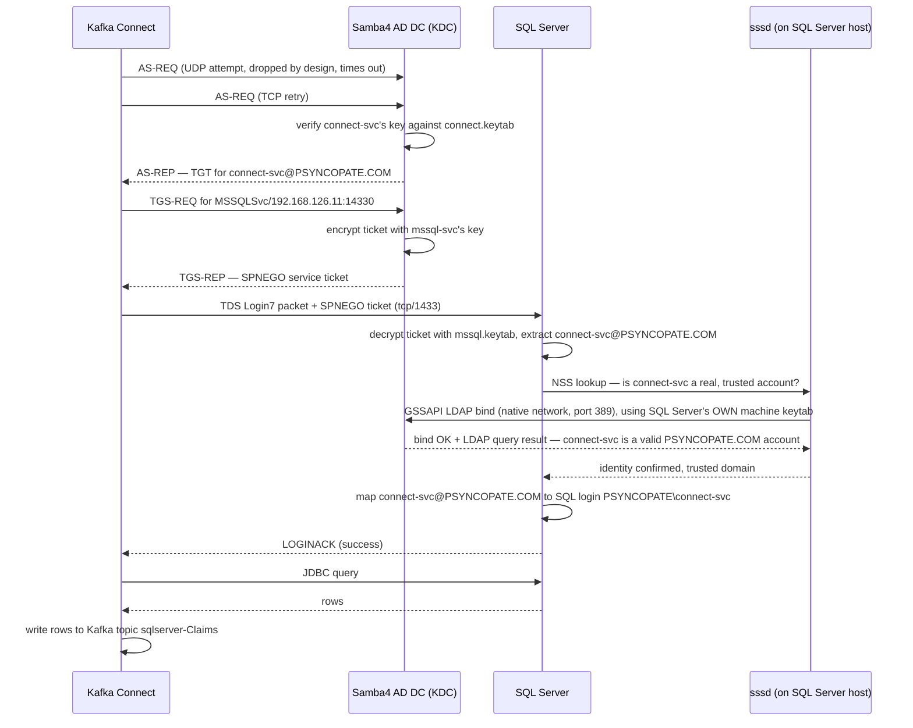

Every hop above is a real port and a real config file, not an abstraction:

| Port | Protocol | Hop | Tunneled from the cluster? |
|---|---|---|---|
| 88 | TCP | AS-REQ / TGS-REQ | Yes — to CRC node port `18088` |
| 88 | UDP | (unused in practice) | No — explicitly `DROP`ped on the CRC node, see §20 |
| 389 | TCP+UDP | LDAP + CLDAP (domain discovery, `sssd` binds) | No — native Docker network only |
| 1433 | TCP | TDS (JDBC) | Yes — to CRC node port `14330` |
| 464 | TCP | kpasswd (unused day-to-day) | No |
| 53 | TCP+UDP | DNS SRV record resolution | No |

## 20. Four Kerberos Configuration Layers

This is the model to internalize before touching any script — every later scenario in §21 is expressed purely in terms of which of these four layers changes.

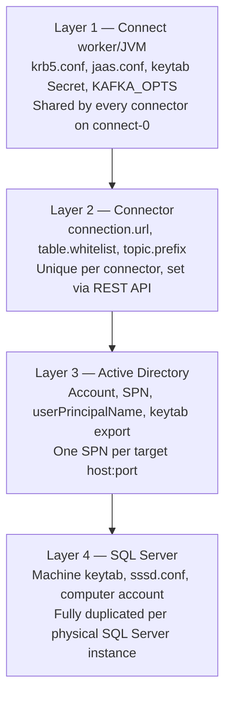

**Layer 1 — Connect worker/JVM.** Set once, JVM-wide, read once at startup:
- ConfigMap `connect-krb5-conf` (`base/confluent-platform/connect-krb5-configmap.yaml`), key `krb5.conf`, mounted at `/mnt/krb5/krb5.conf` — `default_realm = PSYNCOPATE.COM`, `kdc = 192.168.126.11:18088`, `udp_preference_limit = 1`.
- ConfigMap `connect-jaas-conf` (`connect-jaas-configmap.yaml`), key `jaas.conf`, mounted at `/mnt/jaas/jaas.conf` — entry `SQLJDBCDriver` (the mssql-jdbc driver's default lookup name), `principal="connect-svc@PSYNCOPATE.COM"`, `useKeyTab=true`, `keyTab="/mnt/secrets/connect-keytab/connect.keytab"`.
- The keytab itself: `Secret connect-keytab`, key `connect.keytab`, sealed as `base/confluent-platform/secrets/connect-keytab-sealed.yaml`, mounted at `/mnt/secrets/connect-keytab/connect.keytab`.
- `connect-kerberos-patch.yaml` wires all of the above into the base `Connect` CR via `spec.mountedSecrets`, `spec.mountedVolumes`, and `spec.podTemplate.envVars` (`KRB5_CONFIG`, `KAFKA_OPTS` pointing the JVM at both files), and also declares the connector plugin install itself: `spec.build.type: onDemand`, `spec.build.onDemand.plugins.confluentHub: [{owner: confluentinc, name: kafka-connect-jdbc, version: "10.8.4"}]` — a live download from Confluent Hub at pod-init time, not a baked-in image.

> **Implementation Finding.** `connect-krb5-configmap.yaml` and `connect-jaas-configmap.yaml` both carry header comments referencing per-step scripts (`scripts/kerberos/02-create-principals.sh`, `05-deploy-connector.sh`, `07-setup-connect-tunnel.sh`) that no longer exist — `scripts/kerberos/` today contains exactly two files, the consolidated `setup-kerberos.sh` and `validate-kerberos.sh`. These are stale comments left over from an earlier, split-script version of the automation; harmless, but don't go looking for those numbered scripts.

**Layer 2 — Connector.** Set per-connector via Connect's REST API (never a file in this repo): `connection.url=jdbc:sqlserver://<host>:<port>;databaseName=Dev-Lily;integratedSecurity=true;authenticationScheme=JavaKerberos;encrypt=false;`, `table.whitelist=Claims`, `topic.prefix=sqlserver-`, plus the usual source-connector fields (`mode=timestamp+incrementing`, converters, `tasks.max`).

**Layer 3 — Active Directory.** One SPN per target `host:port`, created directly on the Samba4 AD DC via `samba-tool` (not `net ads join`, and not `ktpass` — this repo's script avoids `net ads join`'s own post-join self-check, which is unreliable against this Samba setup even for a genuinely valid account). The exact identities in play:

| Account | Type | SPN | Purpose |
|---|---|---|---|
| `connect-svc` | user | none (authenticates as itself) | Connect's Kerberos client identity |
| `mssql-svc` | user | `MSSQLSvc/192.168.126.11:14330` | SQL Server's service identity |
| `<hostname>$` | computer | `HOST/<hostname>.psyncopate.com` | SQL Server host's own machine identity, used by `sssd` |

The SPN string is derived by the JDBC driver **from the connection URL itself** — this is the rule that matters most once you add a second instance (§21): whatever `host:port` a connector's `connection.url` names, the SPN in AD must match that string exactly, or the TGS-REQ in §19 fails with `Server not found in Kerberos database`.

**Layer 4 — SQL Server.** Fully duplicated per physical instance, never shared: its own machine keytab (`/etc/krb5.keytab`, used by `sssd`, not by the TDS code path directly), its own `mssql.keytab` (`/var/opt/mssql/secrets/mssql.keytab`, used by the SQL Server process itself to decrypt incoming service tickets), its own `sssd.conf` (`id_provider = ad`, `ad_domain = psyncopate.com`), and — in this local environment specifically — its own SSH reverse tunnel. §21 shows exactly why this layer, alone among the four, can never be shared between two SQL Server instances: each host must independently prove *to itself*, via its own `sssd` bind, that the domain is trusted.

## 21. Multiple Connectors / Multiple SQL Servers

Four scenarios, each expressed as a delta against the baseline (one SQL Server, one connector):

| Scenario | Layer 1 | Layer 2 | Layer 3 | Layer 4 |
|---|---|---|---|---|
| **A — baseline** | 1 identity | 1 connector | 1 SPN | 1 instance |
| **B — same instance, +1 connector** (e.g. a second database on the same SQL Server) | unchanged | +1 connector | unchanged | unchanged |
| **C — +1 SQL Server instance, +1 connector** | unchanged | +1 connector | +1 SPN | +1 instance (own tunnel, own keytab, own `sssd`, own computer account) |
| **D — +1 Connect-side identity** (optional) | +1 JAAS entry + keytab | +1 connector | +1 SPN | +1 instance |

**Scenario B is the cheapest change possible:** one Connect worker, one Kerberos identity, two connectors both talking to the same SQL Server instance and the same SPN — `connect-svc` requests a service ticket for `MSSQLSvc/192.168.126.11:14330` once, and *both* connectors' JDBC connections reuse it, without either connector knowing the other exists. Only Layer 2 (a second REST `PUT` with a different `databaseName=`/`table.whitelist=`) changes.

**Scenario C is where the real cost lives**, and it lives in Layer 4, not Layer 3: a second SQL Server instance needs its own SSH tunnel (in this local environment only — see the callout below), its own computer account and machine keytab, and its own `sssd` bind — because each SQL Server host has to independently verify trust for itself; that verification is inherently per-host, never shareable. Layer 1 stays untouched — the same `connect-svc` TGT is reused to request a *second*, independent service ticket for the new SPN. Whether the new SPN lives on the existing `mssql-svc` account (less setup) or a dedicated `mssql-svc-2` (better blast-radius isolation) is a real tradeoff worth making deliberately, not defaulting on.

**Scenario D only exists for governance, not technical necessity** — giving a second connector its own JAAS entry (`SecondSvcEntry`, its own keytab) so its Kerberos activity is independently auditable. This is the *only* one of the four scenarios that touches Layer 1 at all, and it's opt-in.

> **Local Lab Limitation.** The SSH-tunnel-per-instance cost in Scenario C is **specific to this Mac's networking constraint (§18)**, not a Kerberos requirement. §18 already showed why: SSH can't carry the UDP-based domain-discovery traffic, and each SQL Server host's tunnel exists only to get its TCP-only Kerberos/TDS traffic across that one specific gap.

### Production Kerberos Architecture

Remove every local-only workaround and the picture simplifies considerably:

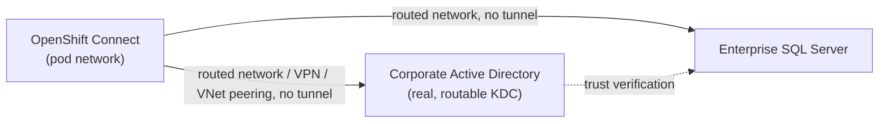

What disappears entirely in production: every SSH reverse tunnel, the CRC-node `iptables -j DROP` rule for UDP 18088, and the requirement that the AD DC and SQL Server share one Docker network — none of these are Kerberos concepts, all of them exist only because of this Mac's local networking gap. What changes, layer by layer:

- **Layer 1:** `krb5.conf`'s `kdc =` becomes the AD DC's real routable hostname; production should set `dns_lookup_kdc = true`/`dns_lookup_realm = true` instead of a hardcoded `kdc=`, since real AD publishes `_kerberos._tcp`/`_kerberos._udp` DNS SRV records — this gives automatic KDC discovery and fallback across multiple domain controllers, which a hardcoded single IP never can.
- **Layer 2:** `connection.url`'s host:port becomes SQL Server's real FQDN/port — no tunnel-port indirection (`14330` instead of `1433`, etc.) to remember.
- **Layer 3:** managed by a real AD/domain-admin team via `ktpass`/ADUC/PowerShell (`New-ADServiceAccount`, `setspn`) instead of `samba-tool` — the SPN-matches-the-connection-URL rule is identical either way.
- **Layer 4:** if SQL Server runs on Windows, there is no `sssd` at all — Windows' own SSPI/LSA stack performs the equivalent trust check natively. If it runs on Linux, `sssd` behaves exactly as documented here, and `net ads join` is expected to work normally against a real Windows AD (the local POC's avoidance of `net ads join` was specifically a Samba4 self-check quirk, not a general recommendation).

**What a real deployment should also add, explicitly not covered by this local POC:** encryption in transit to SQL Server (`encrypt=true`, vs. this repo's `encrypt=false`), a defined keytab rotation cadence and its automation, real secret management (**Vault or an External Secrets Operator**, replacing `docker cp`-and-`kubeseal`-from-a-laptop with a domain admin's `ktpass` output landing directly in a managed secret store), least-privilege SQL login grants (this POC grants `db_datareader` — verify that's still the right scope for production data), and AD account-lockout/monitoring policy for service accounts. None of these are Kerberos protocol concerns — they're the operational maturity layer a real production rollout needs on top of the protocol this Part has walked through end to end.

---

# Part VI — Apache Flink

## 22. What Flink Is

Flink is a distributed stream-processing engine. A **JobManager** coordinates a job's execution and holds coordination state (checkpoint metadata, job graph); one or more **TaskManagers** actually execute the work, each offering a fixed number of **slots** — a slot is a scheduling unit that runs a slice of the job's **parallelism**. A **checkpoint** is a consistent, periodic snapshot of every operator's state, taken automatically for fault tolerance; a **savepoint** is the same mechanism triggered manually, typically to support a planned upgrade rather than automatic recovery. This repository's job uses the **RocksDB state backend** — an embedded key-value store that spills state to local disk instead of keeping it entirely in JVM heap, which is what makes large keyed state practical (Part VII, §33 covers RocksDB's own metrics in depth). "Exactly-once" describes an end-to-end delivery guarantee between checkpointing and a transactional sink — this job's checkpointing mode is `EXACTLY_ONCE` (§24), but its Kafka sink's delivery guarantee is `AT_LEAST_ONCE` (a deliberate choice, explained in §24, not an oversight). A **restart strategy** governs what happens after a task failure — not explicitly configured in this job's code, so it inherits the cluster's default.

**Kafka Streams vs. Flink, briefly and practically.** Kafka Streams is a client library — your application *is* the processing topology, deployed and scaled exactly like any other Kafka consumer application, with no separate cluster to run. Flink is a standalone distributed system with its own JobManager/TaskManager processes, its own resource manager integration (here, Kubernetes), and its own checkpoint/state-backend machinery independent of Kafka's own consumer-group mechanics. The tradeoff is operational surface area (Flink is a platform to run; Kafka Streams is a library to deploy) versus capability (Flink's state backends, windowing, and multi-source joins go well beyond what a Kafka-Streams-only design comfortably supports). This repository chose Flink because CFK ships tooling for it (even though, as §23 shows, that tooling doesn't end up being the path actually used).

## 23. Flink Deployment Architecture

This is a genuine point of confusion worth resolving precisely, because two entirely different control planes exist side by side in this repository, and only one of them works.

**The abstractions, disambiguated:**

| Abstraction | CRD | Who reconciles it | Used in this repo? |
|---|---|---|---|
| Confluent Manager for Apache Flink (CMF) | — (a REST API + controller, not itself a CRD) | `cmf-operator` deployment | Installed, but not on the working path (see below) |
| `FlinkEnvironment` | `platform.confluent.io/v1beta1` | CFK operator, via CMF | **Confirmed never reconciled** in this build |
| `FlinkApplication` | `platform.confluent.io/v1beta1` | CFK operator, via CMF | **Confirmed never reconciled** in this build — kept on disk for reference only |
| `FlinkDeployment` | `flink.apache.org/v1beta1` | native **Flink Kubernetes Operator** | **This is the actually-deployed, actually-working path** |

**What CMF actually is.** `base/flink-jobs/cmf-restclass.yaml` (`CMFRestClass`, pointing CFK's Flink CRDs at `http://cmf-service.cmf-operator.svc.cluster.local`) and `base/flink-jobs/flink-environment.yaml` (`FlinkEnvironment`, whose only meaningful field is `kubernetesNamespace: flink-jobs`) exist to register a namespace-scoped Flink workspace with CMF, and `base/flink-jobs/flink-application.yaml` (CFK's own `FlinkApplication`) is the CR that would, in theory, submit and run the actual job through that workspace.

**Why it doesn't work in this build, and how thoroughly that was checked before concluding it's a defect rather than a misconfiguration:** `ENABLE_CMF_DAY2_OPS` defaults to compiled-in `false` and was explicitly set to `"true"` in `base/confluent-operator/subscription.yaml`'s `spec.config.env` (§9) — required just to get CFK's Flink controllers registered at all. Even with that fix, `FlinkEnvironment`/`FlinkApplication` objects sit with an empty `.status` and zero events, indefinitely. RBAC was checked and is not the cause (`oc auth can-i list/watch flinkenvironments.platform.confluent.io --as=system:serviceaccount:confluent-operator:confluent-for-kubernetes` returns `yes`). CMF's own reachability was checked and is not the cause. Manually forcing a reconcile (`oc annotate flinkenvironment ... force-reconcile=... --overwrite`) produces nothing — not even a new log line. This was observed across 4+ days and 3 separate generation bumps with zero CFK log lines related to either CRD, ever. The current working theory is a binary-level gap specific to this OLM-bundle build of the operator versus the Docker-Hub-sourced image the Helm chart would pull — but regardless of the precise root cause, the practical conclusion is settled: **do not build new Flink jobs against `FlinkApplication` in this environment; it will sit idle indefinitely with no error to act on.**

**The path that actually works:** `base/flink-jobs/flink-deployment.yaml`, `apiVersion: flink.apache.org/v1beta1, kind: FlinkDeployment` — a completely different, **native** Apache Flink Kubernetes Operator, installed via Helm (`apps/flink-kubernetes-operator-app.yaml`, chart `flink-kubernetes-operator` v1.150.2) rather than through CFK/OLM at all. It has no dependency on CMF, CFK's Flink controllers, or `ENABLE_CMF_DAY2_OPS`, and it reconciles this repository's real, running Flink job. `base/flink-jobs/kustomization.yaml` deploys `flink-deployment.yaml` and `flink-rbac.yaml` only — `cmf-restclass.yaml`, `flink-environment.yaml`, and `flink-application.yaml` are present in the same directory purely for side-by-side reference and comparison, and are **not** part of the applied kustomization.

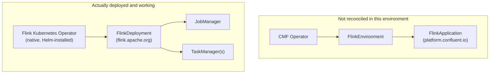

**The RBAC gotcha worth knowing before you touch this yourself.** `base/flink-jobs/flink-rbac.yaml`'s `flink-role` grants `apiGroups: ["apps"], resources: ["deployments", "replicasets"], verbs: ["*"]` — and, *separately*, `apiGroups: ["apps"], resources: ["deployments/finalizers"], verbs: ["update"]`. That second rule is not redundant with the first: Kubernetes treats a resource's `/finalizers` subresource as a distinct RBAC target, not covered by a wildcard verb on the base resource. Confirmed live: without it, the JobManager (acting through `flink-service-account`) failed to create the TaskManager Deployment with *"cannot set blockOwnerDeletion if an ownerReference refers to a resource you can't set finalizers on"* — setting `blockOwnerDeletion: true` on a child object's ownerReference specifically requires `update` on the parent kind's `/finalizers` subresource. This is a genuinely easy trap: `verbs: ["*"]` on `deployments` looks like it should cover everything about deployments, and it doesn't cover this.

## 24. Flink Job Walkthrough

**Source → build → deploy pipeline, as actually used in this environment (not the CI pipeline — see the Implementation Finding below):**

```text
flink-jobs/claims-processor/src/main/java/.../ClaimsProcessorJob.java
 ↓ mvn -q package -DskipTests               (maven-shade-plugin, mainClass set, finalName claims-processor)
target/claims-processor.jar
 ↓ docker build --platform linux/arm64 .    (Dockerfile: FROM flink:1.19-java11; COPY jar to /opt/flink/usrlib/)
image tagged & pushed to the CRC-internal registry
 ↓
oc delete pod -n flink-jobs -l type=flink-native-kubernetes   (force a fresh pull, imagePullPolicy: Always)
 ↓
Flink Kubernetes Operator reconciles flink-deployment.yaml → JobManager → TaskManager(s)
```

> **Implementation Finding.** `.github/workflows/ci-flink-build.yaml` is a complete, correctly-written pipeline — checkout, `mvn package -DskipTests`, `docker/build-push-action` to `ghcr.io/mkurre/flink-jobs/claims-processor`, tagged `sha-<short-sha>`, then an automated commit bumping `base/flink-jobs/flink-application.yaml`'s `spec.image` to match. It targets the **unused** `FlinkApplication` CRD (§23), not the deployed `FlinkDeployment`, and per its own Dockerfile's header comment, **it has never actually run in this environment** — no GitHub Actions execution has occurred, and no `ghcr.io` image has ever been published. The image actually running today was built and pushed by hand, straight to the CRC-internal registry, using the exact three commands shown above. If you wire this CI pipeline up for real, retarget it at `flink-deployment.yaml`'s `spec.image` field, not `flink-application.yaml`'s.

**The code itself**, `com.statefarm.flink.ClaimsProcessorJob`:

```java
DataStreamSource<String> claims = env.fromSource(source, WatermarkStrategy.noWatermarks(), "raw-claims-source");
DataStream<String> deduped = claims
        .keyBy(record -> record)                     // key = the raw record itself
        .process(new DedupeByContent())
        .name("dedupe-by-content");
DataStream<String> processed = deduped
        .keyBy(record -> Math.floorMod(record.hashCode(), 8))   // key = one of 8 integer buckets
        .process(new RunningCountPerBucket())
        .name("running-count-per-bucket");
processed.sinkTo(sink);
```

- **Source:** `KafkaSource<String>` on topic `raw-claims` (CLI default, overridable via `--input-topic`), consumer group `claims-processor`, `OffsetsInitializer.earliest()`, deserialized with plain `SimpleStringSchema` — **no Schema Registry, no Avro**, unlike the JDBC Connect pipeline (Part IV, §12 already flagged this distinction).
- **Watermark strategy:** `WatermarkStrategy.noWatermarks()` — this job does no event-time processing whatsoever; every operator here is purely keyed-state-driven, not windowed.
- **Operator 1, `DedupeByContent`** (`KeyedProcessFunction<String, String, String>`): a `MapState<String, Long>` named `"seen-claim-ids"`, keyed by the record's own content, with a real TTL config —
  ```java
  StateTtlConfig.newBuilder(Duration.ofMinutes(5))
      .setUpdateType(StateTtlConfig.UpdateType.OnCreateAndWrite)
      .setStateVisibility(StateTtlConfig.StateVisibility.NeverReturnExpired)
      .cleanupInRocksdbCompactFilter(1000)
      .build();
  ```
  If the incoming record is already a key in `seenState`, it's dropped silently; otherwise it's recorded and passed through. Cleanup happens inside RocksDB's own compaction filter (checked every 1000 entries processed) rather than via a Flink-side timer — a RocksDB-specific optimization only available because this job uses the RocksDB backend.
- **Operator 2, `RunningCountPerBucket`** (`KeyedProcessFunction<Integer, String, String>`): a `ValueState<Long>` named `"claims-seen-per-bucket"`, no TTL, incremented per record and emitted as a hand-built JSON string (`{"processedAt":...,"bucket":...,"seqForBucket":...,"claim":...}`).
- **Sink:** `KafkaSink<String>` to topic `processed-claims` (default, overridable via `--output-topic`), `DeliveryGuarantee.AT_LEAST_ONCE`. **This is deliberately not exactly-once at the sink**, even though `execution.checkpointing.mode` is set to `EXACTLY_ONCE` in the deployment CR — those are two independent guarantees: checkpointing mode governs whether Flink's *own internal state* is consistent across a failure; sink delivery guarantee governs whether *downstream* (Kafka, here) sees each record exactly once, at least once, or (with a transactional producer) exactly once end-to-end. This job chose the simpler `AT_LEAST_ONCE` sink deliberately, so a downstream consumer of `processed-claims` should be idempotent if exact duplication matters to it.
- **No checkpointing config appears in the Java source at all** — `execution.checkpointing.interval`/`mode` live entirely in the CR's `flinkConfiguration` (§25), not in code. This is itself worth noticing: this job's fault-tolerance behavior is fully externalized to the deployment manifest, which is exactly the kind of thing GitOps makes easy to audit and change without a rebuild.

Why two different state primitives exist in one small job, in the source's own words: *"a purely stateless `map()` gives RocksDB nothing to track at all, confirmed live"* — the whole job exists to emit real, honest RocksDB metrics into the observability stack (Part VII, §33), not to perform real business logic. Two operators produce two distinct RocksDB column families (`seen-claim-ids`, `claims-seen-per-bucket`), which is what makes the dashboard's RocksDB row show real, non-placeholder numbers.

## 25. Flink Failure and Recovery

**JobManager failure.** The Flink Kubernetes Operator restarts the JobManager pod; on restart, the job resumes from its most recent completed checkpoint (checkpoint metadata is what a restarted JobManager uses to recover the running job's state, not just its own process state).

**TaskManager failure.** The job's tasks running on that TaskManager fail; depending on the restart strategy in effect, Flink either restarts the affected tasks (or the whole job graph) from the latest checkpoint. This job's CR does not set `restart-strategy` explicitly in `flinkConfiguration`, so it inherits Flink's own cluster-level default.

**Checkpoint restore vs. savepoint vs. application upgrade.** A checkpoint restore is automatic, triggered by failure detection. A savepoint is manually triggered and is the mechanism intended for planned changes — e.g., upgrading the job's code while preserving its state. `spec.job.upgradeMode` governs which of these an upgrade actually uses: this repo's deployed `flink-deployment.yaml` sets `upgradeMode: stateless` (a code/config change simply restarts the job with no state carried over — appropriate for this job, since it holds no state worth preserving across a deliberate upgrade); the unused `flink-application.yaml`, by contrast, sets `upgradeMode: savepoint` — a real, meaningful difference between the two CRs that's easy to miss if you're comparing them only casually. **State compatibility** matters whenever `upgradeMode` does carry state forward: renaming a keyed operator, or changing a state primitive's type, breaks a savepoint's ability to restore into the new code — Flink matches saved state back to operators by name/UID, not by position in the job graph.

**Practical validation commands:**

```bash
# Confirm the job is RUNNING and see its restart count
oc get flinkdeployment statefarm-claims-processor -n flink-jobs -o jsonpath='{.status.jobStatus.state}{"\n"}'

# Force a TaskManager failure to observe real recovery behavior
oc delete pod -n flink-jobs -l component=taskmanager

# Watch it come back and resume, rather than restart from zero
oc get pods -n flink-jobs -w
```

---

# Part VII — Observability

## 26. Observability Architecture

The metrics pipeline has two genuinely different source mechanisms feeding one collector, plus a completely separate pipeline that exists only for Control Center's own UI (already described in Part IV, §15 — not repeated here).

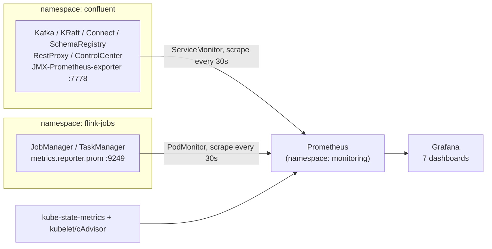

**Why a PodMonitor for Flink but a ServiceMonitor for everything else:** every CFK-managed component gets a headless `Service` with a port literally named `prometheus` (→ 7778), which a `ServiceMonitor` selects by label. The Flink Kubernetes Operator creates **no Service at all** for the metrics port — `metrics.reporter.prom` listens directly on the pod (port 9249–9250). A `ServiceMonitor` has nothing to select in that case; a `PodMonitor` selects pods directly by label instead, which is exactly what `base/observability/podmonitors/flink-podmonitor.yaml` does (`selector.matchLabels: {type: flink-native-kubernetes}`).

**Kubernetes/OpenShift metrics** come from a second, independent source: `kube-state-metrics` (object-level state — pod phase, container restarts, PVC capacity) and the kubelet's own built-in cAdvisor endpoint (container-level CPU/memory). Neither needs a ServiceMonitor of this repo's own — the `kube-prometheus-stack` Helm chart wires both in automatically when `kubelet.enabled: true`/`kubeStateMetrics.enabled: true` (this repo's actual settings — every control-plane-focused scrape target the chart ships, `kubeApiServer`/`kubeControllerManager`/`coreDns`/`kubeEtcd`/`kubeScheduler`/`kubeProxy`, is explicitly disabled, since this platform has no interest in OpenShift's own control-plane internals).

## 27. Prometheus Operator

Five distinct pieces, easy to conflate by name alone:

| Piece | What it actually is |
|---|---|
| **Prometheus Operator** | The controller that watches `ServiceMonitor`/`PodMonitor`/`PrometheusRule`/`Prometheus` CRs and generates Prometheus's actual scrape config from them |
| **Prometheus** | The time-series database + scrape engine itself — one CR (`Prometheus`) describes one running instance |
| **ServiceMonitor** | "Scrape whatever Service matches this label selector, on this named port, at this path/interval" |
| **PodMonitor** | The same idea, but selecting pods directly (no Service required) — used only for Flink here |
| **PrometheusRule** | A `PrometheusRule` CR holds both alerting rules *and* recording rules — two different things, same CRD |
| **Alertmanager** | The component that would route firing alerts to a real notification channel — **explicitly disabled** in this deployment; alerts are visible in Prometheus/Grafana, but nothing pages anyone yet (§35 covers this precisely) |

This repository deploys a **dedicated** Prometheus Operator + Prometheus + Grafana via the `kube-prometheus-stack` Helm chart (`apps/observability-app.yaml`, chart v88.2.0), rather than enabling OpenShift's built-in User Workload Monitoring (UWM) — confirmed disabled on this cluster before making that choice, not assumed. Part XIV, §61 records this as a formal architecture decision with its tradeoffs; the practical reason stated here is enough for now: it keeps resource sizing and dashboard/rule ownership entirely inside this git repo, matching this repo's existing Helm-via-Argo-CD pattern (`cmf-operator`, `flink-kubernetes-operator`) rather than depending on OpenShift's own monitoring stack's internal wiring.

`crds.enabled: false` in the Helm values — the `ServiceMonitor`/`PodMonitor`/`PrometheusRule`/`Prometheus`/`Alertmanager` CRDs already exist cluster-wide (installed by OpenShift's own `cluster-monitoring-operator` regardless of UWM's on/off state); this chart only needs to run its own controller against them, not install them again.

**Sizing (CRC-appropriate, not production defaults):** Prometheus 200m/512Mi requests, 8h retention, single replica, no Thanos, 5Gi PVC; Grafana 100m/256Mi; Prometheus Operator 100m/128Mi (admission webhooks disabled); `node-exporter` and the chart's default etcd/apiserver/scheduler alert bundle both **disabled** — none of them relevant to workloads this repo actually runs, and every disabled piece is CPU/memory this tight node needs elsewhere.

## 28. Metrics Discovery

**The one rule that matters more than any specific metric name.** The JMX-Prometheus-exporter running on port 7778 uses **generic MBean-to-metric conversion** — for most Confluent metrics, the *real identity* of what you're looking at lives in a `name` **label**, not in the metric name itself:

```promql
# WRONG - this metric name does not exist
kafka_server_underreplicatedpartitions

# RIGHT - the metric is generic; the identity is the "name" label
kafka_server_replicamanager_value{name="UnderReplicatedPartitions"}
```

This applies broadly: `kafka_server_replicamanager_value`, `kafka_controller_kafkacontroller_value`, `kafka_network_requestmetrics_*`, `kafka_server_brokertopicmetrics_count`, and more — always check the label set before concluding a metric doesn't exist. **Discovery workflow, in order:**

```bash
# 1. What metric names exist at all right now?
curl -s http://localhost:9090/api/v1/label/__name__/values

# 2. What "name" label values does a specific generic metric carry?
curl -s 'http://localhost:9090/api/v1/query?query=kafka_server_replicamanager_value'

# 3. Confirm a specific combination actually has data
curl -s 'http://localhost:9090/api/v1/query?query=kafka_server_replicamanager_value{name="UnderReplicatedPartitions"}'

# Or, the packaged shortcut for all of the above:
scripts/list-platform-metrics.sh kafka   # also: connect | schemaregistry | restproxy | jvm | infra | flink | all
```

**Discover before you dashboard — this is a repository convention, not a suggestion.** Every panel and alert expression referenced anywhere in this Part was checked against this cluster's real Prometheus before being written down; §36's cardinality discussion and the dashboard walkthrough in §34 both depend on that discipline having actually been followed.

## 29. Kafka Observability

Real metric names, confirmed against this cluster, organized by operational question:

**Cluster health** — broker availability (`up{job="kafka"}`), controller health (`sum(kafka_controller_kafkacontroller_value{name="ActiveControllerCount"})`, should always equal exactly `1`), offline partitions (`kafka_controller_kafkacontroller_value{name="OfflinePartitionsCount"}`, should always be `0`), under-replicated partitions (`kafka_server_replicamanager_value{name="UnderReplicatedPartitions"}`), under-min-ISR (`...{name="UnderMinIsrPartitionCount"}` — distinct from under-replicated; a partition can be under-replicated without yet violating `min.insync.replicas`, but crossing under-min-ISR means producers using `acks=all` start failing outright).

**Topics** — throughput (`kafka_server_brokertopicmetrics_count{name="BytesInPerSec"|"BytesOutPerSec", topic="..."}`, carries a real `topic` label), messages (`...{name="MessagesInPerSec"}`), partition/log-size detail visible per-topic in dashboard 02 (Part IV, §11 already covered what RF=1 means for what "replicated" is worth here).

**Requests** — produce/fetch rate (`...{name="TotalProduceRequestsPerSec"|"TotalFetchRequestsPerSec"}`), failures (`...{name="FailedProduceRequestsPerSec"|"FailedFetchRequestsPerSec"}`), p99 latency (`kafka_network_requestmetrics_99thpercentile{name="TotalTimeMs", request="Produce"|"FetchConsumer"|"FetchFollower"}`).

**JVM** — heap (`java_lang_memory_heapmemoryusage_used`/`_max`), non-heap (`java_lang_memory_nonheapmemoryusage_used`), threads (`java_lang_threading_threadcount`), CPU (`java_lang_operatingsystem_processcpuload`) — identical query shape across *every* JMX-exporter-scraped component, not just Kafka (dashboard 23 exploits exactly this uniformity, Part VII §34).

**Storage** — PVC usage (`kubelet_volume_stats_used_bytes`/`_capacity_bytes{persistentvolumeclaim=~"data0-kafka.*"}`), the basis for the `KafkaDiskUsageHigh`/`KafkaDiskUsageCritical` alerts (§35).

## 30. Producer / Consumer / Consumer Group Visibility

Be precise about what this stack can and cannot see — this is a place where it would be easy to overstate the platform's own capability, and the repository's own docs are careful not to.

**Broker-side aggregate traffic** (what this stack actually has): `kafka_server_brokertopicmetrics_count`/`kafka_network_requestmetrics_*` show real produce/fetch rates and bytes, aggregated per topic or per broker — genuinely useful, genuinely real, but **with no per-producer-application identity**, because Kafka brokers themselves don't track which specific client produced which bytes.

**Client-side application telemetry** (what this stack does *not* have, for most clients): true per-producer visibility would require the producing application's own JMX/OpenTelemetry instrumentation, scraped as its own separate target with its own `job`/`app` label — not fabricated here for anything that doesn't already expose it. The one genuine exception is Kafka Connect's own `kafka_connect_source_task_metrics_source_record_write_rate` — the closest thing to real per-application producer telemetry that exists in this stack, because Connect *is* itself a JMX-exposed, scraped application (Part IV, §13).

**Consumer lag and its cardinality cost.** `kafka_consumer_consumer_fetch_manager_metrics_records_lag` (and `_lag_max`/`_lag_avg`) is genuinely one of the most valuable metrics for SRE work — and it's also, per label shape (`client-id` × `topic` × `partition`), the single highest-cardinality metric family in this whole stack. A single consumer group reading a 50-partition topic already produces 50 distinct series for that one metric alone, before counting a second consumer group. §36 covers this specific tradeoff and the recording-rule mitigation available if it ever becomes a real problem at scale. Separately, Control Center exposes `rest_utils_consumer_group_total_lag{groupId="..."}` for groups it's actively tracking — real, but dynamic/on-demand, not a standing Prometheus series the way the broker-side metric is.

## 31. Connect Observability

Directly tied to the one real pipeline this platform runs (Part V) — every metric below answers a question about the JDBC Source Connector specifically, not a hypothetical:

- **Worker health:** `up{job="connect"}`, `kafka_connect_connect_worker_metrics_connector_count`.
- **Connectors/tasks:** running/failed/paused task counts (`kafka_connect_connect_worker_metrics_connector_{running,failed,paused}_task_count`).
- **Rebalances:** total rebalances, rebalance epoch, time since last rebalance/heartbeat — from the previously-unused `kafka_connect_connect_coordinator_metrics_*` family, added specifically to answer "is this worker's group membership stable?"
- **JDBC Source polling (the pipeline's actual heartbeat):** `kafka_connect_source_task_metrics_source_record_poll_rate` (records read from SQL Server, before transforms) vs. `..._source_record_write_rate` (records actually produced to Kafka, after transforms) — these two together answer "is the connector reading from SQL Server but failing to write to Kafka" vs. "is it healthy end-to-end," which a single combined metric could not distinguish.
- **Batch timings:** poll batch avg/max time — a sustained increase here, with poll rate unchanged, usually means the SQL Server query itself is slowing down, not Kafka.
- **Task failures:** total record failures/errors/skipped, DLQ produce requests/failures — `kafka_connect_task_error_metrics_total_record_failures` is exactly the metric the `KafkaConnectorTaskFailed` alert (§35) watches.

## 32. Schema Registry / REST Proxy / Control Center Metrics

**Schema Registry** (dashboard 10 — see §34): API success/failure counts, schema-created/deleted counters (genuinely `0` right now, since this pipeline has registered exactly one schema and never deleted one — "shown honestly rather than hidden," per the dashboard's own description), REST traffic rate/size, group-membership/coordinator health (same rebalance-metric shape as Connect, §31), TLS certificate expiration timestamps.

**REST Proxy:** JVM + process metrics only, via the same port-7778 pattern as everything else — Part IV, §14 already noted nothing in this environment actively drives traffic through it, so treat any REST-Proxy-specific throughput panel as structurally present but currently idle, not broken.

**Control Center:** scraped on port 7778 for its *own* JVM/process metrics only, by design — its embedded Prometheus/Alertmanager sidecars are a deliberately separate, internal concern (Part IV, §15) and are never scraped by this stack, to avoid, as the ServiceMonitor's own comment puts it, "Prometheus scraping itself twice."

## 33. Flink Observability

> **Implementation Finding — read this before trusting any other Flink-observability doc in this repo.** `docs/observability-architecture.md`, `docs/prometheus-metrics-guide.md`, and `docs/grafana-dashboard-guide.md` all describe Flink metrics as an unimplemented gap ("no Prometheus endpoint on this cluster," "not available yet," "5 dashboards deferred"). That was true when those docs were written and is **no longer true today.** The actual manifests — `base/observability/podmonitors/flink-podmonitor.yaml`, `base/flink-jobs/flink-deployment.yaml`'s `flinkConfiguration`, and dashboard `24-flink-mvp.json` itself — show it fully implemented, live-audited (**359 real series** confirmed via `curl :9249/metrics` directly against both pods), and deployed as one of exactly 7 dashboards this repository ships. Trust this Part and the manifests, not those three older docs, on Flink's observability status specifically.

**JobManager metrics — implemented and verified:** `flink_jobmanager_numRunningJobs`, `numRegisteredTaskManagers`, `taskSlotsTotal`/`taskSlotsAvailable`, job uptime/restarts/fullRestarts/downtime, checkpoint counts/duration/size, phase timing (created/deploying/initializing/running/restarting/failing/cancelling), JVM CPU/heap/GC (`flink_jobmanager_Status_JVM_*`).

**TaskManager metrics — implemented and verified:** per-operator/task throughput (`numRecordsInPerSecond`/`numRecordsOutPerSecond`), watermarks, busy/idle/backpressured time, buffer pool usage, mailbox latency, JVM (`flink_taskmanager_Status_JVM_*`), the full Kafka source client (`KafkaSourceReader_*`) and Kafka producer/sink client metrics, and Sink API v2 committables.

**RocksDB metrics — implemented, and explicitly gated on real keyed state, not just backend choice.** Switching `state.backend` to `rocksdb` alone produced **zero** `rocksdb_*` metrics — confirmed live before adding real state. Only once the job held genuine keyed state (§24's two operators) did background-errors, write-stopped, delayed-write-rate, running-compactions, data/memtable size, compaction/flush-pending, and block-cache usage/capacity all start reporting real, non-zero values. This is the single clearest example in this whole repository of the "never fake a metric" discipline: rather than claim RocksDB observability was done once the config flag was set, the job's own logic was changed until the metrics were real.

**Checkpoint metrics — implemented:** completed/failed/in-progress counts, last checkpoint duration/size, full/persisted/processed data size, last completed checkpoint ID — all driven by the CR's `execution.checkpointing.interval: "60000"` / `mode: EXACTLY_ONCE` (Part VI, §24/§25).

## 34. Grafana Dashboards

All seven are auto-provisioned via a sidecar in the Grafana pod watching for ConfigMaps labeled `grafana_dashboard: "1"` across every namespace (`base/observability/grafana/dashboard-configmaps/*.yaml`) — there is no manual JSON import anywhere in this repository's workflow. The raw JSON under `grafana/dashboards/*.json` is the source of truth; the ConfigMap wrappers are generated from it and shouldn't be hand-edited directly.

| # | Dashboard | The operational question it answers |
|---|---|---|
| 01 | Streaming Platform Overview | Is the platform healthy, at a glance, right now? |
| 02 | Kafka Platform (KRaft + Brokers + Topics) | Is Kafka healthy, balanced, and actually moving traffic? |
| 08 | Connect Platform | Is data actually flowing from SQL Server into Kafka, end to end? |
| 10 | Schema Registry | Is schema registration/compatibility enforcement healthy? |
| 22 | Kubernetes/OpenShift Resources | Are pods constrained by CPU, memory, restarts, or PVC pressure? |
| 23 | JVM Deep Dive | Is the Java runtime itself the bottleneck, across every JMX-scraped component? |
| 24 | Flink | Is the job running, keeping up, and is its state backend healthy? |

**How to actually interpret dashboard 02, not just list its panels:** its "Platform Health" row (Brokers Online, Active Controllers, Under-Replicated/Offline Partitions, Network Processor Idle %, Request Handler Idle %) is the correct first stop for "is Kafka okay" — a healthy cluster shows exactly 3 brokers online, exactly 1 active controller, and 0 offline/under-replicated partitions. Its Idle-% panels are bargauges specifically because a radial gauge draws one full dial per series, and three brokers in a narrow panel becomes an unreadable wall of cramped dials — a real UX decision made and documented in the dashboard's own history, not an accident. Its "Gaps found vs. reference dashboard" row exists because this dashboard was diffed against a real external reference dashboard and had genuine gaps filled in (Preferred Replica Imbalance, Under Min ISR, per-topic/per-broker breakdowns) — every one confirmed live before being added, none guessed from the reference's panel titles alone.

**How to interpret dashboard 08:** "Source task metrics" is the row that answers the pipeline's actual health question directly — Poll Rate vs. Write Rate together distinguish "SQL Server side is the problem" from "Kafka side is the problem," which neither metric alone can do.

**How to interpret dashboard 24:** start with "Cluster Overview" (is the job even running, are TaskManagers registered) before anything else; "Backpressure & Task Time Breakdown" — specifically the Worst Backpressure Ratio gauge — is the single panel most likely to explain a "why is this job slow" question, since sustained values above roughly 0.5 mean a downstream operator or sink genuinely can't keep up. The RocksDB row only becomes meaningful once you know (from §33) that it's reporting on real state, not a placeholder.

`kube-prometheus-stack` also ships its own generic Kubernetes dashboards (Compute Resources by Cluster/Namespace/Pod/Workload, Networking, Persistent Volumes) automatically, free with the Helm chart — visible in Grafana alongside these seven, and not something this repository built or maintains.

## 35. Alerting

Four `PrometheusRule` files (`base/observability/rules/`), each covering a distinct concern. Real alert names, real expressions, real thresholds — every row below is exactly what's deployed, not a paraphrase:

| Alert | Expression | For | Severity | First command |
|---|---|---|---|---|
| `KafkaBrokerDown` | `up{job=~"kafka\|kraftcontroller"} == 0` | 2m | critical | `oc get pods -n confluent -l app=kafka` |
| `KafkaOfflinePartitions` | `kafka_controller_kafkacontroller_value{name="OfflinePartitionsCount"} > 0` | 1m | critical | `oc logs kafka-0 -n confluent \| grep -i partition` |
| `KafkaUnderReplicatedPartitions` | `kafka_server_replicamanager_value{name="UnderReplicatedPartitions"} > 0` | 5m | warning | Check which broker/partition via dashboard 02 |
| `KafkaUnderMinISR` | `kafka_server_replicamanager_value{name="UnderMinIsrPartitionCount"} > 0` | 5m | critical | Producers with `acks=all` are about to start failing — same investigation as above, higher urgency |
| `KafkaNoActiveController` | `sum(kafka_controller_kafkacontroller_value{name="ActiveControllerCount"}) != 1` | 2m | critical | `oc get kraftcontroller kraftcontroller -n confluent -o wide` |
| `KafkaHighRequestLatency` | `kafka_network_requestmetrics_99thpercentile{name="TotalTimeMs", request=~"Produce\|FetchConsumer"} > 1000` | 5m | warning | Dashboard 02's request-latency-breakdown row |
| `KafkaDiskUsageHigh` / `...Critical` | PVC used/capacity ratio `> 0.80` / `> 0.90` | 10m / 5m | warning / critical | `oc get pvc -n confluent` |
| `KRaftControllerUnavailable` | `up{job=~"kraftcontroller"} == 0` | 2m | critical | `oc get pods -n confluent -l app=kraftcontroller` |
| `SchemaRegistryDown` | `up{job="schemaregistry"} == 0` | 2m | critical | `oc get pods -n confluent -l app=schemaregistry` |
| `KafkaConnectWorkerDown` | `up{job="connect"} == 0` | 2m | critical | `oc get pods -n confluent -l app=connect` — this is the JDBC Source Connector's own worker |
| `KafkaConnectorFailed` | `kafka_connect_connect_worker_metrics_connector_failed_task_count > 0` | 2m | critical | `curl -sk https://connect.apps-crc.testing/connectors/sqlserver-claims-source/status` |
| `KafkaConnectorTaskFailed` | `increase(kafka_connect_task_error_metrics_total_record_failures[5m]) > 0` | 0m | warning | Same status check — a failure count without a full task failure yet |
| `KafkaConnectNoRunningTasks` | tasks configured `> 0` AND running tasks `== 0` | 3m | critical | Every configured task is paused/failed/unassigned — no records flowing at all |
| `PodCrashLooping` | `increase(kube_pod_container_status_restarts_total[15m]) > 3` | 0m | warning | `oc describe pod <pod>` — start with events |
| `ContainerOOMKilled` | `kube_pod_container_status_last_terminated_reason{reason="OOMKilled"} == 1` | 0m | critical | Fires immediately, no delay — "never a transient blip." Check `oc describe pod` for the actual limit hit |
| `HighCPU` / `HighMemory` | sustained `> 1.5` cores / `> 8Gi` | 10m | warning | Thresholds are deliberately generous for this environment — tune down for a smaller/tighter deployment |
| `PodPending` | `phase="Pending"` for 10m+ | 10m | warning | Usually resource headroom or an SCC/scheduling problem — `oc describe pod` |
| `PVCAlmostFull` | used/capacity `> 0.80` | 10m | warning | `oc get pvc -A` |

Plus two recording-rule groups (`kafka.recording`, `connect.recording`) that exist purely to normalize the generic `{name="..."}` label pattern (§28) into clean, memorable series names like `kafka:cluster:messages_in_rate` — not alerts themselves, but the basis several dashboard panels and future alerts could build on more cheaply.

> **Implementation Finding.** Alertmanager is **explicitly disabled** in this deployment (§27) — every alert above will fire and become visible in Prometheus's own Alerts UI and (if wired into a panel) Grafana, but **nothing currently routes a firing alert to a real notification channel** (Slack, email, PagerDuty). Wiring a receiver is a real, separate follow-up requiring credentials this repository doesn't have yet — don't assume paging works just because the rules exist.

## 36. Prometheus Cardinality

**The core idea.** Every unique combination of a metric name and its label values is one time series, stored independently. A metric's *label* dimensions, not its name, determine how many series it actually produces — this is why generic-JMX metrics with a `name` label already carry more series than they appear to at first glance, and why a metric with a `topic` or `partition` label multiplies with the real topic/partition count in a live cluster.

**By metric family, from lowest to highest cardinality risk in this stack:**

| Metric family | Labels | Grows with |
|---|---|---|
| `kafka_server_replicamanager_value{name=...}` | `pod` only | broker count — no topic/partition dimension at all |
| `kafka_controller_kafkacontroller_value{name=...}` | `pod` only | broker count |
| `kafka_network_requestmetrics_*{name=...}` | `request`, `pod` | request-type count (bounded, ~10–15 values) × broker |
| `kafka_server_brokertopicmetrics_count{name=...}` | `topic`, `pod` | topic count × broker count |
| `kafka_connect_source_task_metrics_*` | `pod`, task identity | connector task count |
| `container_cpu_usage_seconds_total` / `..._working_set_bytes` | `namespace`, `pod`, `container` | pod count |
| **`kafka_consumer_consumer_fetch_manager_metrics_records_lag`** | `client-id`, `topic`, `partition` | **partition count × consumer count — the most expensive metric in this list** |

**Why consumer lag is called out specifically:** a single consumer group reading one 50-partition topic already produces 50 distinct series just for that one metric — multiplied by however many consumer groups actually exist. This is a non-issue on this local cluster today (there are effectively no independent consuming applications yet), but it's the one metric family worth budgeting for deliberately before scaling up: either accept the cost (it's genuinely one of the most valuable SRE metrics that exists, often worth paying for) or pre-aggregate with a recording rule (`sum by (topic) (...)`, collapsing the partition dimension) if per-partition granularity isn't actually needed day to day.

**What this stack deliberately keeps low-cardinality, on purpose, not by oversight:** no per-partition broker-side replica metrics (`LeaderCount`/`PartitionCount` on `kafka_server_replicamanager_value` are per-broker *totals*, not broken out by partition — getting real per-partition ISR detail would need a different, currently-unscraped metric source and would multiply cardinality by partition count across every topic); no per-client-id producer metrics (§30 already explained brokers don't track that identity at all); and the `monitoring` namespace's own rule/ServiceMonitor selectors are scoped by exact namespace label rather than left wide open — confirmed live this dropped the visible rule-group count from 54 (about 49 of them OpenShift's own internal groups, irrelevant to this platform) down to exactly 5, this stack's own.

---

# Part VIII — Complete Hands-On Installation

Only now, having covered what every piece is and why it's there, does it make sense to actually install it. Every step below names the real repository file/script involved — none of this is "run this command and trust it."

## 37. Mac Prerequisites

| Tool | Why | Verify |
|---|---|---|
| [CRC (CodeReady Containers)](https://crc.dev/) | The local single-node OpenShift cluster | `crc version` |
| Docker Desktop | Runs SQL Server + the Samba4 AD DC (Part V, §18) | `docker version` |
| `oc` CLI | Talk to the OpenShift API | `oc version` |
| `helm` | Installs cert-manager, sealed-secrets, kube-prometheus-stack, CMF, Flink Kubernetes Operator | `helm version` |
| `kubeseal` | Encrypts secrets before they're safe to commit (Part III, §8) | `kubeseal --version` |
| `git` | — | `git --version` |
| `java` (11+) and `mvn` | Only needed to rebuild the Flink job (Part VI, §24) | `java -version` |
| `gh` (GitHub CLI) | Only needed for the (currently unused, Part VI §24) CI-driven image build path | `gh --version` |

**Apple Silicon (arm64) consideration.** This Mac's CRC VM runs natively on arm64 (Part V, §18 already covered why this matters for SQL Server specifically). If you rebuild the Flink job yourself, build with `--platform linux/arm64` — building with `linux/amd64` on this architecture produces a real segfault in the JobManager's config parser, confirmed the hard way earlier in this platform's own history.

**Hardware reality check.** With everything running (3 Kafka brokers, 1 KRaft controller, Connect, Schema Registry, REST Proxy, Control Center, the full observability stack, one Flink job), this node commonly sits above 90% of its allocatable CPU/memory requests on an 8 vCPU/~24Gi CRC allocation. There is little headroom for anything beyond what's described in this guide — §56 and §57 cover exactly what to trim if you're on a smaller machine.

## 38. Start CRC

```bash
crc setup      # first time only
crc start      # every time after
```

**Expected:** after several minutes, `OpenShift: Running`. **Verify:**

```bash
crc status
oc login -u kubeadmin -p "$(crc console --credentials -o json | jq -r '.clusterConfig.kubeAdminPass' 2>/dev/null || echo 'see crc start output')" https://api.crc.testing:6443 --insecure-skip-tls-verify=true
```

**If this fails:** `crc status` showing `OpenShift: Unreachable`/`Degraded`/`Starting` for more than a few minutes is not necessarily broken — `crc start` is idempotent and non-destructive; re-running it is the correct recovery, not `crc delete`. **`crc start` prints a new kubeadmin password every single time it runs** — don't reuse an old one from a previous session.

## 39. Bootstrap Platform Services

```bash
git clone https://github.com/mkurre/openshift-cfk-gitops.git
cd openshift-cfk-gitops
./scripts/bootstrap.sh
```

This one script performs all 18 numbered steps that follow (§40–41 below cover the two most conceptually important ones in more depth; this table is the complete map so nothing in it is a surprise):

| Step | What it does |
|---|---|
| 1 | `oc whoami` — confirm you're actually logged in before anything else runs |
| 2 | `oc apply -f base/namespaces/all-namespaces.yaml` — every platform namespace, up front |
| 3–4 | Helm-install `cert-manager` v1.14.0, `installCRDs=true`, every sub-component's `runAsNonRoot: true` set explicitly (Part II, §3's SCC discipline, applied here too); wait for its three deployments to roll out |
| 5–6 | Apply `bootstrap/cert-manager-issuers.yaml`, wait for `platform-ca-issuer` to report `Ready`, then apply `bootstrap/platform-certificates.yaml` — the entire chain from Part III, §7 |
| 7–8 | Helm-install `sealed-secrets` v2.15.0; `kubeseal --fetch-cert` its public cert to `/tmp/sealed-secrets-public-cert.pem` — required before §6 (Seal secrets) can run at all |
| 9 | Prints a reminder only — this script deliberately never generates real credentials itself |
| 10 | `oc apply -f bootstrap/platform-rbac.yaml` and `bootstrap/network-policies.yaml` — cluster-wide RBAC, and the default-deny-plus-explicit-allow firewall from Part II, §3 |
| 12–14 | Create the `argocd` namespace, apply the pinned upstream Argo CD `install.yaml` (core/non-HA manifest — deliberately, since the HA manifest's pod anti-affinity can never schedule on one node), patch around a real upstream bug (the manifest hardcodes `argocd-redis`'s `runAsUser: 999`, which no SCC on this cluster allows — the patch removes it so `restricted-v2` can assign one), wait for every core Argo CD deployment/statefulset to roll out |
| 15 | Layer this repo's own TLS cert, config tuning, RBAC ConfigMap, and Route onto Argo CD; restart `argocd-server` to pick them up |
| 16 | Print the Argo CD URL and the exact command to fetch its bootstrap admin password |
| 17 | `oc apply -f apps/app-of-apps.yaml -n argocd` — **the only manual Application apply in this entire repository; from here, Argo CD deploys everything else** |
| 18 | Print a final summary of every URL and the next manual steps |

**Expected:** the script's own final summary block, ending in a clean exit. **Verify:**

```bash
oc get pods -n cert-manager
oc get pods -n kube-system -l name=sealed-secrets
oc get pods -n argocd
```

**If this fails:** the script is written with `set -euo pipefail` — it stops at the first real failure rather than limping forward, so read the last `==> Step N:` line printed before the error; that tells you exactly which of the 18 steps above to re-investigate.

## 40. Deploy Argo CD

Already covered mechanically in steps 12–17 above — this section is the verification pass. **Expected:**

```bash
oc rollout status deployment/argocd-server -n argocd
argocd login argocd-server.apps-crc.testing --username admin \
  --password "$(oc extract secret/argocd-initial-admin-secret -n argocd --to=-)"
argocd app list
```

You should see `platform-root` plus every child Application from §6's table (`confluent-operator`, `flink-kubernetes-operator`, `cmf-operator`, `confluent-platform`, `flink-jobs`, and — once you push the manifests in §51 — `observability`/`observability-config`), progressing from `OutOfSync`/`Progressing` toward `Synced`/`Healthy` over the following steps as each wave's operator comes up. **If this fails:** `argocd-redis` stuck in `ReplicaFailure`/`FailedCreate` is almost always the exact `runAsUser: 999` issue step 13 patches — confirm the patch actually applied (`oc get deployment argocd-redis -n argocd -o jsonpath='{.spec.template.spec.securityContext}'` should show no `runAsUser` key).

## 41. Deploy cert-manager

Already covered mechanically in steps 3–6 above. **Verify the whole chain is healthy**, not just that the pods are running:

```bash
oc get clusterissuer selfsigned-bootstrap platform-ca-issuer
oc get certificate -A
```

**Expected:** both `ClusterIssuer`s report `Ready`, and every `Certificate` in `bootstrap/platform-certificates.yaml` reports `READY=True`. **If this fails:** see Part X's decision tree for `Certificate` failures — it's almost always the root secret, not the leaf certificate's own spec.

## 42. Deploy CFK

This is the first component Argo CD deploys on its own, once `apps/app-of-apps.yaml` is applied (§39, step 17) — nothing further to run by hand. **Validate:**

```bash
oc get csv -n confluent-operator                     # look for confluent-for-kubernetes.v3.3.0, phase Succeeded
oc get installplan -n confluent-operator              # confirm it needed manual approval, and that you approved it (Part IX/§56)
oc get crd | grep platform.confluent.io                # confirm every CFK CRD registered
oc logs -n confluent-operator deploy/confluent-operator --tail=50
```

**Expected:** the CSV shows `Succeeded`; every `platform.confluent.io` CRD (`kafkas.platform.confluent.io`, `kraftcontrollers...`, etc.) exists. **If this fails:** `installPlanApproval: Manual` (Part IV, §9) means an available install can sit un-applied indefinitely until approved — check `oc get installplan -n confluent-operator` for one awaiting approval before assuming the operator itself is broken.

## 43. Deploy KRaft

Deployed by the `confluent-platform` Application (wave 1), reconciling `overlays/local`'s patched `KRaftController` CR. **Validate quorum health directly, not just pod status:**

```bash
oc get kraftcontroller kraftcontroller -n confluent -o wide
oc get pods -n confluent -l app=kraftcontroller
```

```promql
sum(kafka_controller_kafkacontroller_value{name="ActiveControllerCount"})   # must equal exactly 1
```

**If this fails:** with the local overlay's `replicas: 1` (Part IV, §10), there is no quorum to fail over to — a controller crash here is a full metadata-plane outage until that one pod recovers, not a graceful failover.

## 44. Deploy Kafka

Deployed by the same `confluent-platform` Application, immediately after KRaft is healthy (Part IV, §9's wave table). **Validate all three brokers:**

```bash
oc get pods -n confluent -l app=kafka
oc get kafka kafka -n confluent -o jsonpath='{.status.replicas}{"\n"}'
```

```promql
up{job="kafka"}                                                        # 3 series, all 1
kafka_server_replicamanager_value{name="UnderReplicatedPartitions"}   # should be 0 everywhere
```

**If this fails:** see Part X's Kafka decision tree — check KRaft health (§43) before looking at Kafka itself; a broken controller quorum manifests as broker startup failures that look Kafka-side but aren't.

## 45. Deploy Schema Registry

Wave 3 — depends on Kafka (§44) already being reachable at `kafka:9071`. **Validate:**

```bash
oc get pods -n confluent -l app=schemaregistry
curl -sk https://schemaregistry.apps-crc.testing/subjects
```

**Expected:** an empty JSON array `[]` until the JDBC connector (§47/§48) has produced at least once, at which point `["sqlserver-Claims-value"]` appears.

## 46. Deploy Connect

Wave 4 — the base `Connect` CR (Part IV, §13) deploys here, but **do not expect a healthy, data-flowing connector yet** — the Kerberos-specific patch and the connector registration itself are separate, manual steps in §47. **Validate the worker itself came up:**

```bash
oc get pods -n confluent -l app=connect
curl -sk https://connect.apps-crc.testing/connector-plugins | python3 -m json.tool
```

**Expected:** `connect-0` `1/1 Running`, and `io.confluent.connect.jdbc.JdbcSourceConnector` present in the plugin list (installed live at pod-init time via the Confluent Hub download in `connect-kerberos-patch.yaml`, Part V §20).

## 47. Configure Kerberos

This is the one part of the install that is **not** pure GitOps — it involves live state on Docker Desktop that git cannot describe. Two pieces, done in order:

**A. Start the local infrastructure**, if not already running (idempotent either way):

```bash
docker run -d --name sqltest2 -p 1433:1433 \
  -e "ACCEPT_EULA=Y" -e "MSSQL_SA_PASSWORD=<your-password>" \
  mcr.microsoft.com/mssql/server:2022-latest
# The Samba4 AD DC container is provisioned automatically by the script below - no manual step needed for it.
```

**B. Run the consolidated setup script:**

```bash
SQLSERVER_HOST=<CRC node internal IP> SQLSERVER_PORT=14330 \
  ./scripts/kerberos/setup-kerberos.sh
```

Find the node IP via `oc get nodes -o jsonpath='{.items[0].status.addresses[?(@.type=="InternalIP")].address}'` (almost always `192.168.126.11` on CRC). This one script performs every step documented in Part V's four-layer model: provisions/starts the Samba AD DC container, creates the `connect-svc`/`mssql-svc` AD accounts and the `MSSQLSvc/<host>:<port>` SPN, exports and seals `connect.keytab` into `base/confluent-platform/secrets/connect-keytab-sealed.yaml` (**commit and push this after every run — its contents change every time**), joins SQL Server to the domain and configures its `sssd`, rebuilds the Schema Registry truststore ConfigMap, opens the Connect-side SSH reverse tunnel (and the CRC-node `iptables` UDP-drop rule, Part V §19), creates the `sqlserver-Claims` `KafkaTopic`, and registers the `sqlserver-claims-source` connector via REST.

**Expected:** the script's own final `curl .../status` call pretty-prints JSON showing `"state":"RUNNING"` for both the connector and its one task. **If this fails**, run the companion read-only check script for a faster diagnosis than re-reading logs by hand:

```bash
./scripts/kerberos/validate-kerberos.sh
```

which checks, in order: both Docker containers running, the AD domain actually provisioned, SQL Server's `sssd` resolving AD identities (the exact trust check from Part V §17), the reverse tunnel process alive, the Connect pod's keytab file real size (not the 2-byte placeholder a failed export leaves behind), and the connector's live status.

## 48. Validate JDBC Source Data Flow

**Do not stop at `"state":"RUNNING"`** — that only proves the connector *started*, not that data is moving. Prove the actual pipeline:

```bash
# 1. Confirm SQL Server actually has rows to read
docker exec sqltest2 /opt/mssql-tools18/bin/sqlcmd -C -S localhost -U sa -P '<password>' \
  -Q "SELECT COUNT(*) FROM [Dev-Lily].dbo.Claims;"

# 2. Confirm the connector's own poll/write counters are non-zero and moving
curl -s 'http://localhost:9090/api/v1/query?query=kafka_connect_source_task_metrics_source_record_write_rate' | python3 -m json.tool

# 3. Confirm records actually landed in Kafka
oc exec -n confluent kafka-0 -c kafka -- kafka-console-consumer \
  --bootstrap-server kafka:9071 --consumer.config /mnt/sasl/client.properties \
  --topic sqlserver-Claims --from-beginning --max-messages 5
```

**Expected:** step 3 prints real Avro-deserialized (or raw, depending on your consumer config) claim records, not an empty hang. If step 3 hangs indefinitely with the connector reporting `RUNNING` and step 2 showing a non-zero write rate, check that you're consuming from the right topic — `topic.prefix=sqlserver-` means the topic is literally `sqlserver-Claims`, not `Claims`.

## 49. Deploy Flink

Wave 2 at the app-of-apps level (§6), reconciled by the **native** Flink Kubernetes Operator (Part VI, §23) — not CFK. If you haven't built and pushed the image yet, do that first (Part VI, §24's exact three commands). **Validate:**

```bash
oc get pods -n flink-operator                                    # the operator itself
oc get flinkdeployment statefarm-claims-processor -n flink-jobs -o wide
oc get pods -n flink-jobs
```

**Expected:** one JobManager pod, one TaskManager pod (`spec.taskManager.replicas: 1`), both `1/1 Running`, and `oc get flinkdeployment ... -o jsonpath='{.status.jobStatus.state}'` reporting `RUNNING`. **If this fails:** see Part X's Flink decision tree — check the Flink Kubernetes Operator's own pod logs first (`oc logs -n flink-operator deploy/flink-kubernetes-operator`), not the JobManager's, since a CR-level misconfiguration usually surfaces there first.

## 50. Validate End-to-End Flink Processing

Using the real topic names from Part VI, §24 — **this is an independent flow from §48's SQL→Connect→Kafka pipeline** (Part I's Diagram C already flagged that nothing in this repository bridges the two today):

```bash
# Produce a handful of test records onto the Flink job's actual input topic
oc exec -n confluent kafka-0 -c kafka -- kafka-console-producer \
  --bootstrap-server kafka:9071 --producer.config /mnt/sasl/client.properties \
  --topic raw-claims <<'EOF'
claim-test-1
claim-test-2
claim-test-1
EOF

# Confirm the job deduped the repeat and produced two distinct outputs, not three
oc exec -n confluent kafka-0 -c kafka -- kafka-console-consumer \
  --bootstrap-server kafka:9071 --consumer.config /mnt/sasl/client.properties \
  --topic processed-claims --from-beginning --max-messages 2
```

**Expected:** exactly two JSON records out (`claim-test-1`, `claim-test-2`), each with a `processedAt` timestamp and a `bucket`/`seqForBucket` — proving both `DedupeByContent` and `RunningCountPerBucket` (Part VI, §24) actually ran, not just that the job is "RUNNING" in the operator's eyes.

## 51. Deploy Observability

Two Argo CD Applications: `observability` (Helm-sourced `kube-prometheus-stack`) and `observability-config` (git-sourced ServiceMonitors/PodMonitor/PrometheusRules/dashboards, all under `base/observability/`) — push §6's sealed `grafana-admin` secret first (Part III, §8), then let Argo CD pick up both. **Validate the full pipeline, not just that pods exist:**

```bash
oc get pods -n monitoring
oc port-forward -n monitoring svc/observability-prometheus 9099:9090 &
curl -s http://localhost:9099/api/v1/targets | python3 -c "import json,sys; d=json.load(sys.stdin); print([t['labels']['job'] for t in d['data']['activeTargets'] if t['health']!='up'])"
```

**Expected:** an empty list — every scrape target `up`. **If this fails:** Part X's "Grafana No Data" decision tree walks the exact same chain in reverse, starting from the dashboard panel instead of the Prometheus targets API — use whichever end of the pipeline you're already looking at.

---

# Part IX — Validation

## 52. Final Platform Acceptance Checklist

| Layer | Validation | Expected |
|---|---|---|
| OpenShift | `crc status` | `OpenShift: Running` |
| Argo CD | `argocd app list` | Every Application `Synced`/`Healthy` |
| cert-manager | `oc get certificate -A` | Every `Certificate` `READY=True` |
| CFK | `oc get csv -n confluent-operator` | `confluent-for-kubernetes.v3.3.0`, phase `Succeeded` |
| KRaft | `sum(kafka_controller_kafkacontroller_value{name="ActiveControllerCount"})` | `1` |
| Kafka | `oc get pods -n confluent -l app=kafka` | 3/3 pods `Running`, 0 under-replicated partitions |
| Schema Registry | `curl -sk https://schemaregistry.apps-crc.testing/subjects` | Returns JSON (empty or populated) without TLS error |
| Connect | `curl -sk https://connect.apps-crc.testing/connectors` | `["sqlserver-claims-source"]` |
| Kerberos | `./scripts/kerberos/validate-kerberos.sh` | Every check reports pass |
| SQL→Kafka | Part VIII §48 | Real rows visible on `sqlserver-Claims` |
| Flink | `oc get flinkdeployment ... -o jsonpath='{.status.jobStatus.state}'` | `RUNNING` |
| Kafka→Flink→Kafka | Part VIII §50 | Deduped output on `processed-claims` |
| Prometheus | `curl .../api/v1/targets` | Every target `up` |
| Grafana | Open any of the 7 dashboards | Real, non-empty panels |
| Alerts | `oc get prometheusrule -n monitoring` | 4 objects, 5 total groups |

**One command-driven acceptance pass**, chaining the highest-signal checks:

```bash
oc whoami >/dev/null && \
argocd app list | grep -v Synced | grep -v NAME && echo "ArgoCD: apps not fully synced above" || echo "ArgoCD: all synced" && \
oc get pods -n confluent -l app=kafka --no-headers | awk '{print $2}' | grep -qv '^1/1$' && echo "Kafka: not all brokers ready" || echo "Kafka: 3/3 ready" && \
curl -sk https://connect.apps-crc.testing/connectors/sqlserver-claims-source/status | grep -q '"state":"RUNNING"' && echo "Connect: RUNNING" || echo "Connect: NOT running" && \
oc get flinkdeployment statefarm-claims-processor -n flink-jobs -o jsonpath='{.status.jobStatus.state}' | grep -q RUNNING && echo " / Flink: RUNNING" || echo " / Flink: NOT running"
```

---

# Part X — Troubleshooting

## 53. Troubleshooting Methodology

Work this ladder in order, every time — resist the urge to jump straight to "check the logs" before confirming the object exists and is even scheduled:

```text
Symptom
 ↓
Kubernetes object          (does the CR/pod/service even exist? oc get / oc describe)
 ↓
Events                     (oc describe pod — the Events section, often the whole answer)
 ↓
Logs                       (oc logs — now that you know what you're looking for)
 ↓
Network                    (NetworkPolicy, DNS, Service selector match)
 ↓
Authentication              (TLS trust, SASL credentials, Kerberos — Part V/§7)
 ↓
Application                 (connector config, job config — the CR's own spec)
 ↓
Metrics                     (Prometheus/Grafana — confirms the fix actually worked, not just that the error stopped)
```

The reason this order matters: logs are the most tempting place to start and the most misleading — a component logging a scary error is very often *downstream* of a problem visible earlier in this ladder (a missing NetworkPolicy rule produces a client-side timeout that looks like an application bug in the logs, but isn't one).

## 54. Troubleshooting Decision Trees

### Pod not starting

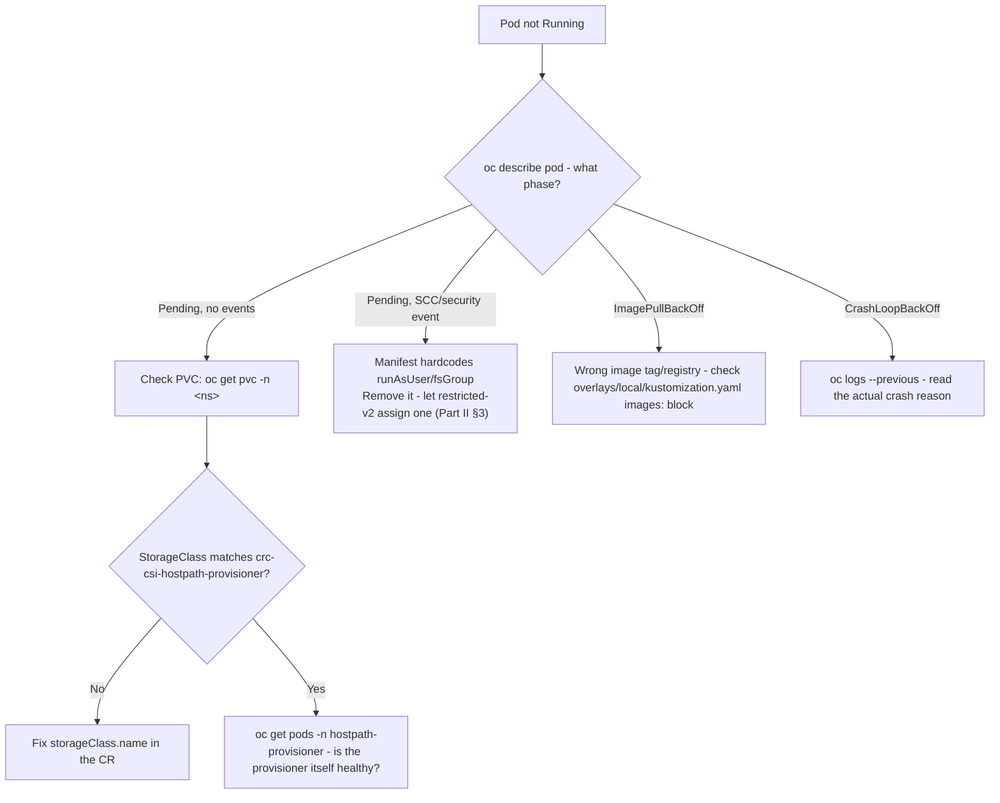

### Kafka unhealthy

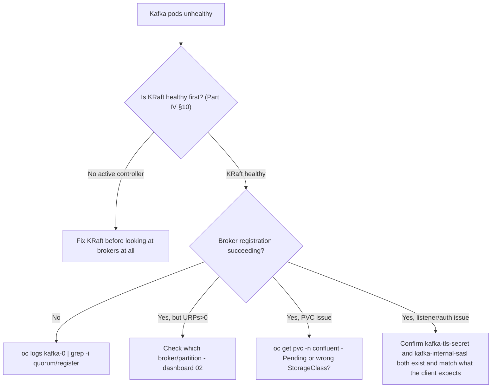

### Connect connector FAILED

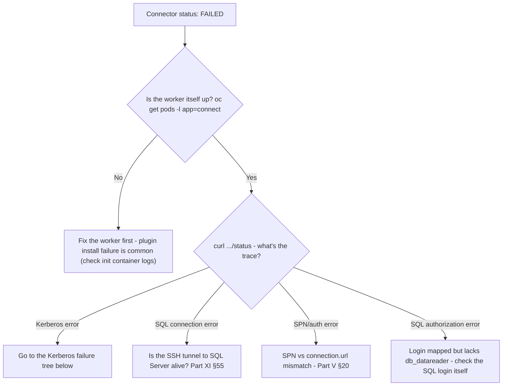

### Kerberos failure

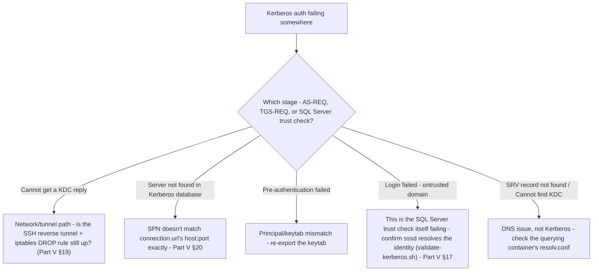

### Grafana "No Data"

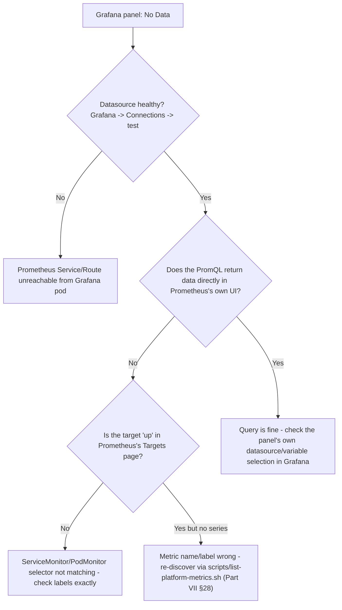

### Flink job failure

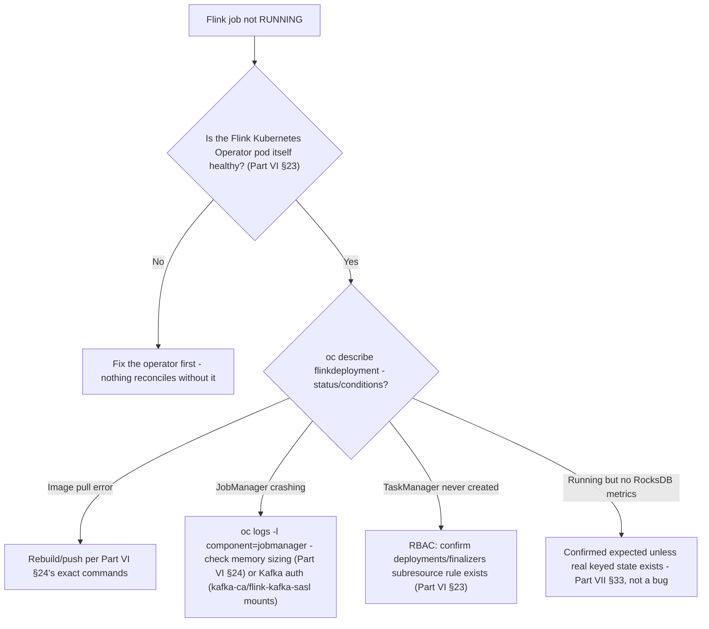

---

# Part XI — Restart and Recovery

## 55. Mac/CRC/Docker Restart Recovery

This is not an edge case — it happens every time you close your laptop, and it deserves a real table, not a vague "restart everything and see."

| Component | Survives CRC restart (`crc stop`/`crc start`)? | Survives Docker Desktop restart? | Required action |
|---|---|---|---|
| Argo CD, all Applications | Yes | N/A | None |
| Kafka PVCs / KRaft metadata | Yes | N/A | None |
| SealedSecrets (already decrypted into cluster Secrets) | Yes | N/A | None — but see below for `crc delete` specifically |
| Flink job state (in-memory/RocksDB, no external checkpoint store, Part VI §25) | **No** — job restarts fresh, `upgradeMode: stateless` | N/A | None needed if state loss is acceptable, which it is for this demo job |
| CRC VM's `GatewayPorts yes` sshd setting | Yes (persists on the VM's own disk across `stop`/`start`) | N/A | None — but does **not** survive `crc delete && crc start` |
| Samba4 AD DC container | N/A | **No** | `docker start sambaad`, or let `setup-kerberos.sh` restart it |
| SQL Server container | N/A | **No** | `docker start sqltest2` |
| Both SSH reverse tunnels (ports 18088, 14330) | **No** — these are plain background `ssh` processes, not systemd units | **No** | Re-establish manually (commands below) |
| Connect's keytab/`sssd` trust state | Yes (lives in the cluster Secret + the SQL Server container's own disk) | Only if the SQL Server container itself survived | Re-run `setup-kerberos.sh` if anything upstream restarted |

**Recovery sequence, in order, every time:**

```bash
# 1. CRC itself
crc start
oc login -u kubeadmin -p <new password from crc start's output> https://api.crc.testing:6443 --insecure-skip-tls-verify=true

# 2. Docker Desktop containers
docker start sqltest2

# 3. Re-establish both SSH reverse tunnels
ssh -i ~/.crc/machines/crc/id_ed25519 -o StrictHostKeyChecking=no -o UserKnownHostsFile=/dev/null \
  -p 2222 -N -R 0.0.0.0:18088:localhost:8088 core@127.0.0.1 &
ssh -i ~/.crc/machines/crc/id_ed25519 -o StrictHostKeyChecking=no -o UserKnownHostsFile=/dev/null \
  -p 2222 -N -R 0.0.0.0:14330:localhost:1433 core@127.0.0.1 &

# 4. Re-run the Kerberos setup script - idempotent, safe to always re-run after any restart
SQLSERVER_HOST=192.168.126.11 SQLSERVER_PORT=14330 ./scripts/kerberos/setup-kerberos.sh

# 5. Re-establish any Grafana/Prometheus port-forwards you use - these die with the restart too
oc port-forward -n monitoring svc/observability-grafana 3000:80 &
```

**A note on a full `crc delete && crc start` specifically** (not just `stop`/`start`): this destroys the sealed-secrets controller's private key along with everything else, which means every previously-sealed `SealedSecret` manifest in git becomes permanently undecryptable (Part III, §8). The recovery here is not to restore anything — it's `./scripts/seal-secrets.sh` against the new controller's public cert, then commit and push the newly-sealed output.

---

# Part XII — Day-2 Operations

## 56. Common Operational Procedures

**Deploy a new Flink job:**
1. Add source under a new `flink-jobs/<job-name>/` Maven project.
2. Build and push its image using the same three commands as Part VI, §24 (or wire up a corrected CI pipeline targeting `FlinkDeployment`, not `FlinkApplication` — §24's Implementation Finding explains why the existing CI file doesn't).
3. Copy `base/flink-jobs/flink-deployment.yaml` as a template — **not** `flink-application.yaml` (Part VI, §23) — update `metadata.name`, `spec.job.jarURI`/`entryClass`/`args`, and add the new file to `base/flink-jobs/kustomization.yaml`.
4. `argocd app get flink-jobs`, then `oc get flinkdeployment -n flink-jobs -w`.

**Update Kafka configuration via GitOps:**
1. Edit `configOverrides` in `base/confluent-platform/kafka.yaml` (cluster-wide) or the relevant `overlays/{local,prod}/kafka-patch.yaml` (environment-specific).
2. Open a PR — `ci-validate.yaml` builds the kustomization to catch syntax errors before merge.
3. Merge to `main`; the `confluent-platform` Application auto-syncs (`prune`+`selfHeal`, Part II §6).
4. `oc get kafka kafka -n confluent -o yaml | yq '.spec.configOverrides'` to confirm the live CR matches.

**Rotate TLS certificates:**
1. Normally automatic — cert-manager renews at `renewBefore: 720h` (30 days) before expiry, no action needed.
2. Force immediate rotation: `oc delete secret kafka-tls-secret -n confluent`, then `oc annotate certificate kafka-tls -n confluent cert-manager.io/issue-temporary-certificate- --overwrite`.
3. Rolling-restart the affected component so it picks up the new secret: `oc rollout restart statefulset/kafka -n confluent`.
4. To rotate the root CA itself (rare, affects every downstream certificate): delete `platform-root-ca-secret` in the `cert-manager` namespace.

**Rotate a Kerberos keytab:** re-run `scripts/kerberos/setup-kerberos.sh` — it's explicitly designed to be re-run in full at any time (Part V, §20), and exports a fresh `connect.keytab` every run. Commit and push the newly-sealed `connect-keytab-sealed.yaml` afterward.

**Resync / recover from drift in Argo CD:**
```bash
argocd app diff confluent-platform     # confirm what's actually different before forcing anything
argocd app sync confluent-platform
```

**Unseal/re-seal secrets after cluster recreation:** covered exactly in Part XI, §55's last paragraph — `scripts/seal-secrets.sh` against the new controller's public cert, commit, push.

**Approve a Manual `InstallPlan` for a CFK upgrade** (Part IV, §9's `installPlanApproval: Manual` gate):
```bash
oc get installplan -n confluent-operator
oc get installplan <name> -n confluent-operator -o yaml   # review what's about to change
oc patch installplan <name> -n confluent-operator --type merge --patch '{"spec":{"approved":true}}'
oc get csv -n confluent-operator -w
```

**Add a Grafana dashboard or a Prometheus alert:** edit the raw JSON under `base/observability/grafana/dashboards/` (never the generated ConfigMap wrapper directly, Part VII §34) or add a rule to the appropriate file under `base/observability/rules/`; **validate every new PromQL expression against the live Prometheus API before committing** (Part VII, §28's discovery workflow) — this repository's own discipline is zero fabricated metrics, and that discipline only holds if every contributor follows it too.

---

# Part XIII — Production Architecture

## 57. Local Lab vs. Production

This is not a hypothetical comparison — the `overlays/prod/` directory already exists in this repo (§5) and already contains real, different values, checked directly against `overlays/local/`:

| Concept | Local (this guide) | Production (`overlays/prod/`, or the documented direction where no file exists yet) |
|---|---|---|
| Cluster | CRC, single node | Multi-node OpenShift, multiple failure domains |
| Kafka pod anti-affinity | `overlays/local/kafka-patch.yaml` nulls it out entirely | `overlays/prod/kafka-patch.yaml` sets `requiredDuringSchedulingIgnoredDuringExecution` — a **hard** requirement, one broker per node |
| Kafka resources | `requests: 500m/2Gi`, `limits: 2/10Gi` (same as base) | `requests: 2/8Gi`, `limits: 4/16Gi` |
| Replication | `default.replication.factor=1`, `min.insync.replicas=1` (cluster-wide, from base) | `overlays/prod/kafka-patch.yaml` adds `default.replication.factor=3`, `min.insync.replicas=2` |
| KRaft controllers | Patched down to `replicas: 1` | Base default `replicas: 3` — no prod override exists yet, meaning prod should simply *not* apply the local patch |
| TLS | Self-signed `platform-root-ca`, cert-manager | Enterprise PKI, real CA |
| Kerberos identity provider | Samba4 AD DC, Docker Desktop | Real corporate Active Directory |
| Network path to AD/SQL Server | SSH reverse tunnels, `iptables` UDP-drop workaround | Routed network / VPN / VNet peering, no tunnel at all (Part V, §21) |
| SQL Server | Docker Desktop container, outside the cluster (arm64 constraint, Part V §18) | Enterprise SQL Server, wherever it already runs |
| Secret management | `kubeseal` from a laptop shell | Vault or External Secrets Operator, ideally with the signing key itself backed up |
| Storage | `crc-csi-hostpath-provisioner` (a directory on the CRC VM's disk) | A real enterprise StorageClass (cloud block storage, Ceph, etc.) |
| Observability | Single-replica Prometheus, 8h retention, no Alertmanager receiver | Prometheus HA/remote-write, real retention policy, real alert routing |
| Recovery model | Manual (§55's checklist, run by a human after every restart) | Automated HA — no human intervention for a single node/AZ failure |

> **Implementation Finding.** `docs/runbook.md`'s "Promote from local overlay to prod overlay" procedure references `overlays/prod/flink-patch.yaml` as something to check before promoting — **no such file exists**; `overlays/prod/` contains only `kafka-patch.yaml` and `kustomization.yaml`. If you're promoting Flink to a prod-shaped overlay, that file needs to be created, not merely checked.

**What stays identical, deliberately:** the CRD shapes (`Kafka`, `KRaftController`, `FlinkDeployment`, ...), the GitOps mechanism (Argo CD, sync waves, `ignoreDifferences`), the Kerberos four-layer model (Part V, §20) and its authentication sequence (Part V, §19) — the *protocol* logic in this platform does not change between local and production, only the *networking and scale workarounds* do. That's precisely the design goal stated in Part I's introduction: this lab teaches the real architecture, not a simplified stand-in for it.

## 58. Production HA

**Broker failure domains.** Real HA requires brokers on genuinely independent nodes (ideally independent availability zones) — `overlays/prod/kafka-patch.yaml`'s hard pod anti-affinity is the mechanism, but it only delivers real HA on a multi-node cluster; on CRC's single node it would simply prevent all three broker pods from scheduling at all (Part II, §3 already named this exact single-node ceiling).

**KRaft quorum.** With the base CR's `replicas: 3` (not the local overlay's `1`), the controller quorum tolerates exactly one controller failure without losing the ability to elect a new active controller or accept metadata writes — this is the actual value of the quorum size, not just "more controllers is safer" in the abstract.

**Replication/ISR.** `default.replication.factor=3`/`min.insync.replicas=2` (already set in `overlays/prod/kafka-patch.yaml`) tolerates one replica being down while still accepting `acks=all` writes — this is the real production posture Part IV, §11 contrasted against this local cluster's RF=1.

**Storage, pod anti-affinity, topology spread, PDBs.** A real deployment should pair the hard anti-affinity already in `overlays/prod/kafka-patch.yaml` with a `PodDisruptionBudget` (absent from this repo entirely today — an explicit gap, not an oversight to gloss over) so voluntary disruptions (node drains, upgrades) can't take out more brokers at once than the replication factor tolerates.

**Flink HA and checkpoint storage.** This local job's checkpoints live nowhere durable — no `state.checkpoints.dir` is configured (Part VII, §33's dashboard description calls this out directly: RocksDB state lives inside the container's own memory/writable layer, not a PVC or object store). A production Flink deployment needs an external, durable checkpoint store (S3-compatible object storage or a real PVC-backed path) so a full JobManager+TaskManager loss doesn't also lose the ability to recover from the last checkpoint.

## 59. Production Security

**Enterprise CA and certificate rotation.** Replace the self-signed `platform-root-ca` with a corporate CA-issued intermediate, or at minimum back up its private key somewhere the platform team actually controls (Part III, §7's chain structure doesn't need to change — only who issues at the top).

**RBAC and least privilege.** `flink-rbac.yaml`'s namespace-scoped `Role`/`RoleBinding` (Part VI, §23) is already a reasonable least-privilege pattern to carry forward — resist the temptation to grant `ClusterRole`s for convenience in production.

**AD integration and service identities.** Part V, §21's production section already covers this in full: real domain-admin-managed SPNs, `dns_lookup_kdc`/`dns_lookup_realm` instead of a hardcoded KDC address, dedicated per-instance service accounts rather than shared ones where compliance requires it.

**Keytab rotation and secret management.** Explicitly *not* implemented in this local POC (Part V, §21 says so directly) — a real deployment needs a defined keytab rotation cadence, and Vault/External Secrets Operator in place of `kubeseal`-from-a-laptop, ideally with the sealed-secrets signing key itself backed up so cluster recreation doesn't invalidate every secret in git (Part III, §8).

**Auditability.** Nothing in this repository currently ships audit logging beyond Kubernetes' own API audit trail and Argo CD's own sync history — a real deployment should decide deliberately whether that's sufficient for its compliance posture, rather than assume it by default.

## 60. Production Observability

**Prometheus HA / remote write.** This repo runs single-replica Prometheus with 8h retention (Part VII, §27) — appropriate for a disposable local cluster, not for a system anyone depends on operationally. Production should run either a real HA Prometheus pair or remote-write into a long-term store (Thanos, Mimir, or a vendor equivalent), with retention measured in weeks/months, not hours.

**Cardinality at scale.** Part VII, §36 already flagged the one metric family (`kafka_consumer_consumer_fetch_manager_metrics_records_lag`) that genuinely needs a deliberate decision before scaling past a handful of consumer groups and topics — revisit that decision explicitly as real usage grows, rather than discovering the cost after the fact in Prometheus's own memory usage.

**Alert routing and SLOs.** Alertmanager is disabled entirely in this build (Part VII, §35) — every alert fires into a void today. Production needs a real receiver (Slack/PagerDuty/email) and, ideally, alert thresholds derived from actual SLOs rather than the "deliberately generous for this environment" defaults this repo's own `infra-rules.yaml` admits to using.

**Centralized logs and dashboard ownership.** This repo has no log-aggregation story at all — `oc logs` against a specific pod is the only mechanism used throughout this entire guide. A production deployment should pair this Prometheus/Grafana metrics stack with a real log-aggregation system (Loki, or an enterprise equivalent), and should assign clear ownership for who maintains the dashboards and alert thresholds as the platform evolves — this repo's own dashboards/rules are entirely git-owned today (Part VII, §34), which is the right foundation for that ownership model but doesn't substitute for someone actually being assigned it.

---

# Part XIV — RSA / Architect Learning

## 61. Architecture Decisions

| Decision | Why | Alternative considered | Tradeoff | Production implication |
|---|---|---|---|---|
| **KRaft, not ZooKeeper** | Fewer moving parts, the direction Kafka itself is moving (ZooKeeper mode is being phased out upstream) | ZooKeeper-mode Kafka | KRaft is comparatively newer in production; verify your Confluent Platform version's KRaft maturity claims for your own use case | Same CRD shape either way — a real migration would need a real ZK→KRaft migration plan, not a fresh install |
| **CFK for Confluent Platform, native FKO for Flink** | CFK doesn't reconcile its own Flink CRDs in this build (Part VI, §23, confirmed exhaustively) | Using CFK's `FlinkApplication` end-to-end, as originally intended | Two different operators, two different CRD families, more surface area to understand | A client already committed to CMF/CFK for Flink should get a fixed/working build confirmed before relying on it — this repo's finding is specific to this build, not necessarily every CFK version |
| **Argo CD, app-of-apps** | Native support for both git-sourced Kustomize and Helm-sourced charts from one tool; matches this team's existing GitOps direction | Flux | Flux was actually tried first for CMF and abandoned when it was never installed on this cluster (Part II, §6's Implementation Finding) | Whichever GitOps tool is chosen, commit to it consistently — mixing tools mid-repository is exactly what produced that stale doc |
| **Kustomize overlays, not Helm, for Confluent Platform** | CFK CRs are plain YAML with no chart of their own; Kustomize's patch model fits "same base, different env" cleanly | A Helm chart wrapping the CRs | Kustomize has weaker templating than Helm for deeply conditional logic | Fine as long as env differences stay patch-shaped (replicas, resources, affinity) rather than needing real conditionals |
| **cert-manager, self-signed root** | Zero external dependency for a disposable local cluster | A real corporate CA from day one | Every certificate's trust chain terminates at a CA nobody outside this cluster would ever trust | Production must swap the root issuer, not the leaf-certificate mechanism (Part XIII, §59) |
| **Sealed Secrets, not Vault/ESO** | Simplest thing that keeps plaintext out of git, no external system to run | Vault, External Secrets Operator | Sealed-secrets' key isn't backed up in this repo — cluster recreation invalidates every secret (Part III, §8) | Production should back up the signing key at minimum, or move to Vault/ESO entirely (Part V, §21; Part XIII, §59) |
| **Samba4 AD DC for local Kerberos, not a plain MIT KDC** | The *only* option that made SQL Server's own trust check pass locally (Part V, §17) — proven by direct failure of the alternative, not assumed | LDAP-backed MIT Kerberos | More complex to stand up (a real AD-schema directory, not just a KDC) | Production uses real Windows AD or an AD-compatible directory anyway — this decision only mattered for reproducing AD-like trust behavior locally |
| **SQL Server + AD DC outside the cluster, on Docker Desktop** | Genuine CPU-architecture (SQL Server) and UDP-tunneling (AD DC) constraints specific to this Mac (Part V, §18) — not a design preference | Running both in-cluster via emulation or a UDP relay | Two extra SSH tunnels, two extra pieces of local infrastructure to keep alive | Zero implication for production — neither constraint exists on a routable, same-architecture enterprise network (Part V, §21) |
| **Prometheus + Grafana as a dedicated stack, not OpenShift UWM** | Full GitOps control over sizing and dashboard/rule ownership; matches this repo's existing Helm-via-Argo-CD pattern | Enabling OpenShift User Workload Monitoring | UWM would have been "free" (no extra pods to size) but hands sizing/RBAC/Thanos-querier auth control to OpenShift's own stack | Either is defensible in production; this repo's choice optimizes for git-owned dashboards/alerts over infrastructure minimalism |
| **Native Flink Kubernetes Operator, not CMF as the operating model** | It's the one that actually reconciles (Part VI, §23) | Waiting for CMF's Day-2 gap to be fixed upstream | Loses CMF's own environment/catalog abstractions; the job is managed at the raw `FlinkDeployment` level | A client should decide deliberately whether CMF's abstractions are worth chasing a fix for, or whether the native operator is simply the right long-term choice regardless |

## 62. Client Discovery Questions

Questions a senior RSA should ask before designing the production equivalent of this platform — organized by the same areas this guide covered, so each maps back to a specific Part:

**Kafka:** Expected sustained throughput (MB/s and messages/s)? Topic/partition count at steady state, and expected growth rate? Retention requirements per topic class? Is RF=3/min.insync.replicas=2 sufficient, or does compliance require more?

**OpenShift:** How many nodes, across how many failure domains/AZs? Existing StorageClass options and their IOPS characteristics for Kafka's write pattern specifically? Existing OLM/operator-approval governance process (who approves an `InstallPlan`, and how fast)?

**Networking:** Any existing constraint resembling this repo's UDP/tunnel problem (segmented networks, firewalled AD, cross-cloud VPC peering)? Expected egress requirements for Connect's plugin installation (Part IV, §13) — is Confluent Hub reachable, or does this need to be pre-baked into an image instead?

**Security / PKI:** Existing enterprise CA — can it issue the volume of certificates this platform needs? Certificate rotation policy already in place elsewhere in the org?

**Active Directory / Kerberos:** Real corporate AD topology — single domain, multiple domains, forest trusts? Who owns SPN creation, and what's the request turnaround? Existing keytab distribution/rotation process, or does one need to be built (Part V, §21)?

**SQL Server:** Number of instances requiring Kafka integration? Per-instance or shared service account model (Part V, §21's Scenario B/C/D tradeoff)? Existing encryption-in-transit requirement (`encrypt=true`) for JDBC?

**Connect:** Expected connector count and per-connector throughput? Sink connectors needed as well as source (this repo has never run one, Part VII §31's discovery report notes)?

**Flink:** Required state size — does it fit comfortably in RocksDB on available node storage, or does it need external checkpoint storage from day one (Part XIII, §58)? Expected job count and their individual resource footprints, distinct from this repo's one deliberately minimal job?

**Storage:** Expected PVC growth rate per component? Snapshot/backup requirements for Kafka's own data, distinct from Flink checkpoint storage?

**DR:** RPO/RTO targets? Cross-region replication requirement (Kafka MirrorMaker or Cluster Linking, neither present in this repo)?

**Observability:** Required metrics retention (this repo: 8h, Part VII §27)? Existing alert-routing infrastructure to integrate Alertmanager into (this repo: none, Part VII §35)? Expected consumer-group/cardinality growth (Part VII, §36)?

**GitOps:** Existing Argo CD (or equivalent) footprint to integrate with, vs. standing up new? Deployment approval model — who can merge to `main`, and does that satisfy change-control requirements?

**Operations:** Who owns Day-2 procedures (Part XII, §56) once this moves past a pilot — a platform team, or the application team that requested it?

## 63. Knowledge Check

<details>
<summary><strong>Why does Kafka still need KRaft if brokers already store topic data themselves?</strong></summary>

Brokers store *record* data (the actual log segments). KRaft (or historically, ZooKeeper) stores *metadata about the cluster itself* — which brokers exist, which broker leads which partition, ACLs, topic configs. A broker can hold gigabytes of records and still be completely unable to function without a healthy metadata layer telling it (and every other broker) the current state of the cluster.
</details>

<details>
<summary><strong>Why is three brokers on one CRC node not true high availability?</strong></summary>

All three broker pods share one physical failure domain — one VM, one kernel, one disk, one NIC. Real HA requires independent failure domains (separate nodes, ideally separate AZs) so that one physical failure can't take out more than one replica at once. This repo's three brokers demonstrate Kafka's *topology* faithfully; they demonstrate nothing about *fault tolerance* (Part II, §3).
</details>

<details>
<summary><strong>What does CFK reconcile, and what does Argo CD reconcile — what's the actual difference?</strong></summary>

Argo CD reconciles Kubernetes objects against git (Applications, and through them, arbitrary manifests including CFK's own CRs). CFK reconciles its own CRs (`Kafka`, `Connect`, ...) against the actual pods/StatefulSets/Services needed to satisfy them. They're the same *pattern* (§4) applied at two different layers — Argo CD never talks to a Kafka broker directly, and CFK never reads git directly.
</details>

<details>
<summary><strong>Why does an SPN need to match the JDBC connection URL exactly?</strong></summary>

The JDBC driver derives the SPN it requests a service ticket for directly from the `host:port` in `connection.url` — not from any separate configuration field. If the SPN registered in AD doesn't textually match that derived string, the TGS-REQ fails with "Server not found in Kerberos database," even though the client's own identity/keytab is completely fine (Part V, §20).
</details>

<details>
<summary><strong>What information does a keytab actually store?</strong></summary>

A principal's long-term encryption key(s) — enough for a service to prove its identity to a KDC without a human typing a password interactively. It is not a password in cleartext, but it is fully equivalent to one for authentication purposes and must be protected exactly as carefully (file permissions `600`/`400`, never committed unencrypted).
</details>

<details>
<summary><strong>Why does SQL Server need AD trust in addition to a cryptographically valid Kerberos ticket?</strong></summary>

A valid ticket only proves the ticket wasn't forged and was issued by a KDC SQL Server's keytab can decrypt — it says nothing about whether the identity inside it belongs to a domain SQL Server is configured to actually trust. That second check is `sssd`'s job (on Linux) or the OS's native SSPI/LSA stack (on Windows), and it's exactly the check that failed against a plain MIT KDC, forcing the move to Samba4 AD (Part V, §17).
</details>

<details>
<summary><strong>Why might Grafana show "No Data" even though Kafka is genuinely healthy?</strong></summary>

Because the metrics pipeline has several independent links, any one of which can break while Kafka itself is fine: the ServiceMonitor's label selector might not match the Service, a NetworkPolicy might be silently dropping the scrape, or the PromQL query itself might reference a metric name that doesn't exist under the generic-JMX-exporter naming pattern (Part VII, §28/§54's decision tree walks this exact chain).
</details>

<details>
<summary><strong>Why can consumer lag create disproportionately high Prometheus cardinality?</strong></summary>

Because it's labeled by `client-id` × `topic` × `partition` — a single consumer group reading a 50-partition topic already produces 50 distinct time series for that one metric alone, before counting a second consumer group. Most other Kafka metrics in this stack are labeled only by broker or by topic, not by partition, which is why this one metric family stands out (Part VII, §36).
</details>

<details>
<summary><strong>What's the difference between a Flink checkpoint and a savepoint?</strong></summary>

Both snapshot operator state consistently, using the same underlying mechanism. A checkpoint is automatic and periodic, meant for failure recovery. A savepoint is manually triggered, meant to support a planned, deliberate operation — most commonly upgrading a job's code while carrying its state forward, which is exactly what `upgradeMode: savepoint` (used in this repo's unused `flink-application.yaml`, but not its actually-deployed `flink-deployment.yaml`, which uses `stateless`) governs (Part VI, §25).
</details>

---

# Putting It All Together

An engineer commits a desired-state change to this git repository and pushes it.

Argo CD detects the new commit and applies the corresponding manifests to the cluster. Operators — CFK, the native Flink Kubernetes Operator, the Prometheus Operator — reconcile their own Custom Resources into real pods, services, and secrets. cert-manager supplies every certificate those pods need to trust each other. The Sealed Secrets controller decrypts credentials that only ever existed in git as ciphertext.

Kafka Connect authenticates to SQL Server using a Kerberos identity issued by a Samba4 Active Directory domain controller — a real AS/TGS exchange, a real service ticket, and a real, independent trust verification on SQL Server's own side, not merely a decrypted ticket. SQL Server authorizes that now-trusted identity against a real SQL login. The JDBC Source Connector reads rows and writes them to Kafka.

Separately, a Flink job consumes from Kafka, performs genuinely stateful processing backed by RocksDB — not a stand-in for state, but state that survives a task restart and shows up as real metrics — and writes its results back to Kafka.

Every one of those components exposes real metrics: JMX-exporter endpoints for the Confluent Platform side, a native Prometheus reporter for Flink. Prometheus discovers and scrapes all of them. PrometheusRule objects evaluate operational conditions against that data continuously. Grafana queries the same data and renders it as the seven dashboards this guide walked through panel by panel.

None of this is a demo standing in for the real thing. It is the real thing, run at a scale one laptop can hold, with every local-only compromise named explicitly rather than hidden — so that the difference between "how this works" and "how this works *here, locally, on a Mac*" stays visible the whole way through. That distinction is the actual subject of this guide, more than any single component in it.

---

# Glossary

| Term | Meaning |
|---|---|
| **AD** | Active Directory — a directory service that also runs a Kerberos KDC and DNS |
| **Argo CD** | The GitOps engine reconciling this cluster's state against this git repository |
| **AS** | Authentication Server — the KDC component issuing the initial TGT |
| **CA** | Certificate Authority — the signer that makes a certificate trustworthy |
| **CFK** | Confluent for Kubernetes — Confluent's own operator for Kafka/KRaft/Connect/SR/RestProxy/Control Center |
| **CMF** | Confluent Manager for Apache Flink — installed in this repo, not on the working Flink control path |
| **CR** | Custom Resource — an instance of a CRD |
| **CRD** | CustomResourceDefinition — teaches the Kubernetes API a new object type |
| **CRC** | CodeReady Containers — OpenShift Local, the single-node cluster this guide runs on |
| **GSSAPI** | The generic security API Kerberos implements underneath JAAS/SSPI |
| **ISR** | In-Sync Replicas — replicas fully caught up with a partition's leader |
| **JAAS** | Java Authentication and Authorization Service — configures the JVM's Kerberos client |
| **JMX** | Java Management Extensions — the source every port-7778 Prometheus metric in this platform is exported from |
| **KDC** | Key Distribution Center — issues Kerberos tickets; here, the Samba4 AD DC |
| **KRaft** | Kafka Raft — Kafka's own Raft-based metadata consensus, replacing ZooKeeper |
| **Kustomize** | The base/overlay/patch manifest-composition tool this repo uses for Confluent Platform |
| **mTLS** | Mutual TLS — client certificate authentication; **not used anywhere in this platform** |
| **OLM** | Operator Lifecycle Manager — how CFK is installed, with manual upgrade approval |
| **PVC** | PersistentVolumeClaim — durable storage request, backed here by `crc-csi-hostpath-provisioner` |
| **RBAC** | Role-Based Access Control — Kubernetes' own permission model |
| **SASL** | Simple Authentication and Security Layer — the credential mechanism (`PLAIN`) every Kafka client in this repo uses, inside a TLS tunnel |
| **SCC** | Security Context Constraint — OpenShift's pod-security admission mechanism; this repo relies on `restricted-v2`'s default UID allocation everywhere |
| **ServiceMonitor** | The CRD telling Prometheus which Service/port/path to scrape |
| **SPN** | Service Principal Name — a Kerberos principal naming a service instance, derived from `host:port` |
| **SPNEGO** | The negotiation wrapper carrying a Kerberos ticket inside another protocol's handshake (here: TDS) |
| **SSSD** | System Security Services Daemon — resolves/caches AD trust information for a Linux host; the mechanism behind SQL Server's own trust check |
| **TGT** | Ticket-Granting Ticket — proof of a completed initial authentication |
| **TGS** | Ticket-Granting Service — the KDC component exchanging a TGT for a service ticket |

