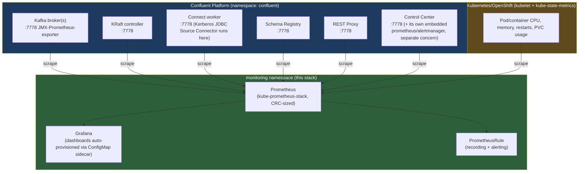

# Observability architecture

Phase 1 of the platform's observability stack: real, verified metrics for
everything that already emits them (Kafka, KRaft, Connect, Schema
Registry, REST Proxy, Control Center, Kubernetes/OpenShift infra), with
Flink and SQL Server explicitly named as later phases with their own
prerequisites - not silently faked in this pass. See
`docs/prometheus-metrics-guide.md` for how every metric name below was
confirmed live, not guessed.

## Why this exists

Confluent Control Center gives Kafka-operational visibility (topics,
consumer groups, connectors) but isn't a general-purpose metrics/alerting
system, and doesn't cover Kubernetes-level resource usage, JVM internals,
or long-term trend analysis. This stack adds that layer underneath/beside
C3, not instead of it.

Control Center is deliberately drawn as a separate consumer of the same
underlying JMX-Prometheus-exporter port - it does NOT feed this
Prometheus, and this Prometheus does not feed C3. Two independent
consumers of the same source data, exactly as the request specified.

## Architecture decision: dedicated Prometheus Operator + Prometheus +
Grafana (not OpenShift User Workload Monitoring)

Two real options existed, and both were actually inspected on this
cluster before deciding (not assumed):

- OpenShift User Workload Monitoring (UWM) was **disabled**
  (`cluster-monitoring-config` didn't exist, no pods in
  `openshift-user-workload-monitoring`). Enabling it gives a managed
  Prometheus + Thanos Ruler for free, but no Grafana either way (OpenShift
  dropped its bundled Grafana years ago), plus it means depending on
  OpenShift's own Thanos-querier auth/RBAC wiring to point an external
  Grafana at it.
- A dedicated Prometheus Operator + Prometheus + Grafana, deployed via
  Helm through Argo CD's native Helm support - the exact same pattern
  this repo already used twice (`apps/cmf-operator-app.yaml`,
  `apps/flink-kubernetes-operator-app.yaml`).

**Decision: dedicated stack.** Reasons: full GitOps control over resource
sizing (this CRC node was already at 73%/86% CPU/memory requests before
this stack, so sizing had to be deliberate, not left to a
production-default UWM install), no dependency on OpenShift's own
monitoring internals, and consistency with this repo's existing
Helm-from-vendor-repo convention. `apps/observability-app.yaml` documents
this decision inline too.

The `ServiceMonitor`/`PodMonitor`/`PrometheusRule`/`Prometheus`/
`Alertmanager` CRDs already existed cluster-wide before this stack was
deployed (OpenShift installs them regardless of UWM state) - this stack's
own Prometheus Operator does **not** install its own copies
(`crds.enabled: false` in the Helm values), to avoid taking ownership of
CRDs OpenShift's own cluster-monitoring-operator manages.

## Sizing (CRC-appropriate, not production defaults)

| Component | Requests | Limits | Notes |
|---|---|---|---|
| Prometheus | 200m / 512Mi | 500m / 1Gi | 8h retention, no Thanos, single replica |
| Grafana | 100m / 256Mi | 200m / 512Mi | dashboards + datasource auto-provisioned |
| Prometheus Operator | 100m / 128Mi | 200m / 256Mi | admission webhooks disabled |
| kube-state-metrics | (chart default) | (chart default) | small, single pod |
| node-exporter | **disabled** | - | DaemonSet giving OS-level metrics not needed for this scope; pod/container metrics already come from kubelet/cAdvisor |
| Alertmanager | **disabled** | - | deferred - rules load and are visible in Prometheus/Grafana without it; a real notification receiver needs credentials this repo doesn't have yet |
| Default rule bundle | **disabled** | - | the chart's etcd/apiserver/scheduler alert bundle is out of scope for this Kafka-focused deployment |

Total added footprint: roughly 400-600m CPU / 900Mi-1.2Gi memory
requests. Confirmed live this fit without destabilizing the existing
Kerberos/Kafka/Connect POC - `oc describe node crc`'s allocated-resources
went from 69%/83% to 73%/86% (CPU/memory requests) after deploying the
full stack, and the Kerberos JDBC Source Connector stayed `RUNNING`
throughout.

## Known limitations (named honestly, not silently worked around)

**Flink has no Prometheus metrics endpoint on this cluster.** Confirmed
live: the Flink Kubernetes Operator pod exposes only a plain-text `OK`
health check on port 8085, not Prometheus exposition format. Port 9249
(Flink's usual Prometheus reporter port) isn't listening. Separately, no
Flink job is actually running - `base/flink-jobs/flink-application.yaml`'s
`FlinkApplication`/`FlinkEnvironment` CRs exist but have never reconciled
into a real `FlinkDeployment` (`oc get flinkdeployments -A` returns
nothing). Building JobManager/TaskManager/Job dashboards now would mean
inventing metrics that don't exist. **Phase 2 prerequisite:** get a real
Flink job running, and enable Flink's own `metrics.reporter.prom.factory.class`
in its `flinkConfiguration` (currently absent - only `state.backend`,
checkpointing interval/mode, and `taskmanager.numberOfTaskSlots` are set).

**SQL Server isn't in the cluster at all** - it runs as a Docker Desktop
container reached via manual SSH tunnels (see
`docs/kerberos-architecture.md`). A SQL Server Prometheus exporter would
need a new exporter container on Docker Desktop plus a new tunnel
following the exact pattern `scripts/kerberos/setup-kerberos.sh` already
uses for the AD DC tunnel - real, buildable, but Mac/Docker-Desktop
infrastructure, not a Kubernetes manifest. **Phase 3.**

**CFK operator and CMF operator have no native Prometheus metrics
endpoint.** Confirmed via their CRD schemas and live pod inspection - only
generic Kubernetes pod/container metrics (CPU, memory, restarts) are
available for these two, via kube-state-metrics/kubelet, same as any
other pod.

**This CRC node cannot currently sustain 3 real Kafka brokers.** CFK's own
automatic "cluster shrink" safety feature scales `kafka.yaml`'s declared
`replicas: 3` down to 1 live, independent of git/Argo - confirmed via the
operator's own reconcile logs (`desiredReplicas: 1` even when the CR
itself says 3). `validate-observability.sh` reports this as a `WARN`, not
a `FAIL`, since it's an accurate reflection of this environment's real
capacity, not a stack bug.

**Prometheus's rule/ServiceMonitor namespace watch is scoped to
`monitoring`, but the operator's own RBAC can still list PrometheusRule
objects cluster-wide** - confirmed live that ~49 of OpenShift's own
internal alerting rule groups (etcd, kube-apiserver, machine-config, etc.)
still show up in this Prometheus's `/api/v1/rules`, evaluating against
metrics this Prometheus doesn't scrape (so they never fire - not a
correctness bug, just wasted evaluation cycles). Not resolved in Phase 1;
would need the operator itself restricted via a `--namespaces` flag or
similar, a bigger change than this phase's scope.

## What's deferred, and why (dashboard coverage)

Of the 24 dashboards requested, 7 are built in Phase 1, backed entirely by
real metrics (see `docs/grafana-dashboard-guide.md` for what each answers):
Platform Overview, Kafka Cluster Overview, Kafka Broker Deep Dive, Kafka
Topics, Connect Overview & Connector Deep Dive (combined), Kubernetes/
OpenShift Resources, JVM Deep Dive.

Deferred, with the specific reason each time:
- **Consumer Groups** - the standard per-partition lag metric
  (`kafka_consumer_consumer_fetch_manager_metrics_records_lag`) exists and
  is real, but nothing in this environment consumes continuously right
  now (the JDBC Source Connector only produces; Control Center's own
  internal consumer groups report near-zero lag by design). Building this
  dashboard today would show an honest but nearly-empty panel - use
  `scripts/generate-observability-load.sh start --lag` to populate it with
  real lag data for a demo.
- **KRaft Controllers, Schema Registry, REST Proxy, Control Center
  (dedicated dashboards)** - the metrics exist (confirmed, same port 7778
  pattern) and are already partially visible via the JVM Deep Dive and
  Platform Overview dashboards; dedicated per-component dashboards follow
  the identical ConfigMap pattern in `base/observability/grafana/` and are
  straightforward to add.
- **Kafka Produce/Fetch (dedicated)**, **Platform Capacity & Storage
  (full)** - same reasoning; the underlying metrics
  (`kafka_network_requestmetrics_*`, `kubelet_volume_stats_*`) are real
  and already used in the Broker Deep Dive/K8s Resources dashboards, just
  not broken out into their own dedicated views yet.
- **Flink (5 dashboards), SQL Server (1)** - see the limitations above.
